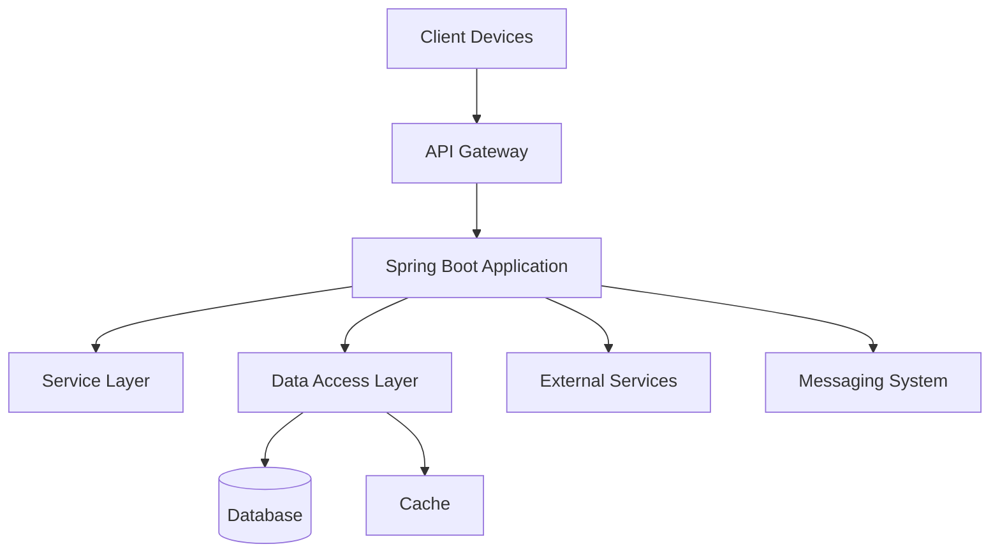

# Chapter 1: Introduction

## Introduction

Welcome to **Chapter 1: Introduction** of the _Comprehensive Java Spring Boot Tutorial_. This chapter lays the foundation for your journey into mastering Java and Spring Boot for building large-scale, enterprise-level microservice applications. As senior backend developers proficient in languages like Node.js and TypeScript, this chapter is tailored to bridge your existing knowledge with the robust capabilities of Java and Spring Boot.

### Overview of the Chapter

- **Significance in Enterprise Java Development**: Understanding the pivotal role of Java and Spring Boot in modern enterprise applications.
- **Building Upon Previous Knowledge**: Transitioning from your current tech stack to Java, highlighting similarities and key differences.
- **Welcome to the Tutorial**: An introduction to the tutorial structure, learning objectives, and what to expect.
- **Why Java Spring Boot?**: Exploring the advantages of Spring Boot and comparing it with other popular frameworks.
- **Setting Up the Development Environment**: A comprehensive guide to configuring your system for Java and Spring Boot development.
- **Best Practices and Design Patterns**: An overview of essential design patterns and best practices in Spring Boot.
- **Common Pitfalls and Troubleshooting**: Identifying and addressing common challenges faced by developers new to Java and Spring Boot.
- **Summary and Next Steps**: Recapping key points and outlining the roadmap for the subsequent chapters.

### Importance in Enterprise-Level Applications

Enterprise applications demand scalability, robustness, and maintainability. Java has long been a staple in enterprise environments due to its performance, security features, and vast ecosystem. Spring Boot enhances Java's capabilities by providing a streamlined framework for building production-ready applications with minimal configuration.



*Figure 1.1: Spring Boot in Enterprise Architecture*

## Significance in Enterprise Java Development

Enterprise Java development leverages the strengths of Java and the Spring ecosystem to build applications that can handle complex business logic, high transaction volumes, and stringent security requirements. Spring Boot simplifies the development process by offering:

- **Auto-Configuration**: Automatically configures your Spring application based on the dependencies added.
- **Embedded Servers**: Packages applications with embedded servers like Tomcat or Jetty, simplifying deployment.
- **Starter POMs**: Provides starter dependencies to quickly set up your project with the necessary libraries.

### Building Upon Previous Knowledge

For developers experienced in Node.js or TypeScript, transitioning to Java and Spring Boot involves embracing a statically-typed language and understanding the Spring Framework's philosophy. Key areas of focus include:

- **Type Safety**: Java's strong type system ensures compile-time type checking, reducing runtime errors.
- **Dependency Injection**: Spring Boot's inversion of control (IoC) container manages dependencies efficiently.
- **Concurrency Model**: Java's threading model differs from Node.js's event-driven architecture, offering different approaches to handling asynchronous operations.

#### Comparative Example: Hello World Server

To illustrate the transition, let's compare a simple "Hello World" server in Node.js and Spring Boot.

**Node.js Example: Basic HTTP Server**

```
// Node.js: Basic HTTP Server
const http = require('http');

const server = http.createServer((req, res) => {
  res.statusCode = 200;
  res.setHeader('Content-Type', 'text/plain');
  res.end('Hello World\n');
});

server.listen(3000, '127.0.0.1', () => {
  console.log('Server running at http://127.0.0.1:3000/');
});
```

**Spring Boot Example: Basic REST Controller**

```
// Spring Boot: Basic REST Controller
package com.example.demo;

import org.springframework.web.bind.annotation.GetMapping;
import org.springframework.web.bind.annotation.RestController;

@RestController
public class HelloController {

    @GetMapping("/hello")
    public String sayHello() {
        return "Hello World";
    }
}
```

*Key Differences*:
- **Language Syntax**: Java's syntax is more verbose and requires defining classes.
- **Framework Usage**: Spring Boot leverages annotations to simplify configuration and routing.
- **Server Setup**: Node.js requires explicit server creation, whereas Spring Boot handles server setup through embedded servers.

## 1. Welcome

### Overview of the Tutorial

This tutorial is meticulously crafted to equip you with advanced-level skills in Java and Spring Boot. As a senior backend developer, you'll engage with hands-on examples, real-world scenarios, and best practices essential for building production-ready applications.

#### Key Components:

- **Comprehensive Content**: Covering everything from Java fundamentals to advanced Spring Boot features.
- **Practical Examples**: Code snippets and projects that mirror real-world applications.
- **Best Practices**: Industry-standard techniques for writing clean, maintainable, and efficient code.
- **Advanced Concepts**: Delving into microservices architecture, security, and performance optimization.

### Learning Objectives

By the end of this tutorial, you will be able to:

1. **Master Java and Spring Boot**: Gain deep insights into Java programming and the Spring Boot framework.
2. **Develop Microservices**: Architect and implement scalable microservice-based applications.
3. **Implement Security**: Secure your applications using Spring Security and industry best practices.
4. **Optimize Performance**: Enhance application performance through effective caching, asynchronous processing, and more.
5. **Deploy Applications**: Navigate the deployment process, including containerization and cloud integrations.

## 2. Why Java Spring Boot?

### Advantages of Spring Boot

Spring Boot revolutionizes Java application development by minimizing boilerplate code and providing a suite of tools that accelerate the development lifecycle. Here are some of the key advantages:

- **Convention over Configuration**: Reduces the need for extensive configuration, allowing developers to focus on business logic.
- **Embedded Servers**: Simplifies deployment by embedding servers like Tomcat or Jetty, eliminating the need for external server setup.
- **Spring Ecosystem Integration**: Seamlessly integrates with other Spring projects like Spring Data, Spring Security, and Spring Cloud.
- **Auto-Configuration**: Automatically configures your application based on the dependencies present in the classpath.
- **Actuator**: Provides built-in endpoints for monitoring and managing your application in production.

#### Comparative Code Example: Application Properties

**Spring Boot: application.properties**

```
# Spring Boot: application.properties
server.port=8080
spring.datasource.url=jdbc:mysql://localhost:3306/mydb
spring.datasource.username=root
spring.datasource.password=secret
```

**Node.js: Configuration with dotenv**

```
# Node.js: .env
PORT=3000
DB_URL=jdbc:mysql://localhost:3306/mydb
DB_USER=root
DB_PASSWORD=secret
```

*Highlights*:
- **Configuration Management**: Spring Boot uses `application.properties` or `application.yml` for centralized configuration, while Node.js often relies on environment variables managed by packages like `dotenv`.
- **Auto-Configuration**: Spring Boot can auto-configure data sources and other components based on properties, reducing manual setup.

### Comparison with Other Frameworks

To appreciate Spring Boot's capabilities, it's essential to compare it with other prevalent frameworks in the backend development space.

#### Spring Boot vs. Node.js (Express.js)

| Feature                     | Spring Boot                                      | Node.js (Express.js)                              |
| --------------------------- | ------------------------------------------------ | ------------------------------------------------- |
| **Language**                | Java                                             | JavaScript                                        |
| **Performance**             | High performance due to JVM optimizations        | Non-blocking I/O for handling concurrent requests |
| **Ecosystem**               | Extensive Spring ecosystem                       | Vast npm ecosystem                                |
| **Scalability**             | Excellent, suitable for large-scale applications | Highly scalable through event-driven architecture |
| **Type Safety**             | Strongly typed                                   | Dynamically typed                                 |
| **Learning Curve**          | Steeper learning curve                           | Gentle learning curve                             |
| **Tooling and IDE Support** | Superior (IntelliJ IDEA, Eclipse)                | Good (VS Code, WebStorm)                          |

#### Spring Boot vs. TypeScript (NestJS)

| Feature                     | Spring Boot                                        | TypeScript (NestJS)                         |
| --------------------------- | -------------------------------------------------- | ------------------------------------------- |
| **Language**                | Java                                               | TypeScript                                  |
| **Architecture**            | Opinionated, heavily utilizes dependency injection | Modular architecture with decorators        |
| **Performance**             | High performance with JVM optimizations            | Competitive performance with Node.js        |
| **Ecosystem**               | Integrated Spring projects                         | Integrated with Node.js ecosystem           |
| **Type Safety**             | Strongly typed                                     | Strongly typed (thanks to TypeScript)       |
| **Scalability**             | Excellent for enterprise applications              | Highly scalable for modern web applications |
| **Tooling and IDE Support** | Superior (IntelliJ IDEA, Eclipse)                  | Excellent (VS Code)                         |

*Takeaway*: While Node.js and TypeScript offer flexibility and ease of use, Spring Boot provides a more structured and scalable framework suitable for enterprise-level applications requiring robust performance and maintainability.

## 3. Setting Up the Development Environment

Setting up a robust development environment is crucial for efficient and effective development. This section guides you through configuring your system for Java and Spring Boot development.

### Installing Java Development Kit (JDK)

Java Development Kit (JDK) is the cornerstone of Java development. Spring Boot requires JDK 11 or higher.

1. **Download JDK**:
   - Navigate to the [Oracle JDK Downloads](https://www.oracle.com/java/technologies/javase-jdk11-downloads.html) page.
   - Alternatively, use [OpenJDK](https://openjdk.java.net/install/) for an open-source version.

2. **Installation Steps**:

   - **Windows**:
     - Run the installer and follow the on-screen instructions.
     - Set the `JAVA_HOME` environment variable to the JDK installation directory.
     - Add `%JAVA_HOME%\bin` to the `PATH` variable.

   - **macOS**:
     - Use Homebrew: `brew install openjdk@11`
     - Update your shell profile:
       ```bash
       export JAVA_HOME=/usr/local/opt/openjdk@11
       export PATH=$JAVA_HOME/bin:$PATH
       ```

   - **Linux**:
     - Use your distribution's package manager, e.g., for Ubuntu:
       ```bash
       sudo apt update
       sudo apt install openjdk-11-jdk
       ```
     - Verify installation:
       ```bash
       java -version
       ```

### Setting Up an IDE (IntelliJ IDEA / Eclipse)

Choosing the right Integrated Development Environment (IDE) enhances productivity. Here's how to set up two popular IDEs:

#### IntelliJ IDEA

1. **Download and Install**:
   - Visit the [IntelliJ IDEA Downloads](https://www.jetbrains.com/idea/download/) page.
   - Choose between the Community Edition (free) or Ultimate Edition (paid).

2. **Configuration**:
   - Install necessary plugins, such as Spring Boot and Lombok support.
   - Configure the JDK in `File > Project Structure > SDKs`.

3. **Create a New Project**:
   - Select `Spring Initializr` to bootstrap your Spring Boot project directly from the IDE.

#### Eclipse

1. **Download and Install**:
   - Visit the [Eclipse Downloads](https://www.eclipse.org/downloads/) page and download the Eclipse IDE for Java Developers.

2. **Configuration**:
   - Install the Spring Tools Suite (STS) plugin for enhanced Spring Boot support via `Help > Eclipse Marketplace`.

3. **Create a New Project**:
   - Use the `Spring Starter Project` wizard to initialize your project with Spring Boot dependencies.

### Installing Maven or Gradle

Build automation tools like Maven and Gradle manage project dependencies and build processes.

#### Maven

1. **Download Maven**:
   - Visit the [Apache Maven](https://maven.apache.org/download.cgi) website and download the binary archive.

2. **Installation**:
   - Extract the archive to a desired location, e.g., `/opt/maven`.

3. **Configure Environment Variables**:
   ```bash
   export MAVEN_HOME=/opt/maven
   export PATH=$MAVEN_HOME/bin:$PATH
   ```

4. **Verify Installation**:
   ```bash
   mvn -v
   ```

#### Gradle

1. **Download Gradle**:
   - Visit the [Gradle Releases](https://gradle.org/releases/) page and download the latest binary.

2. **Installation**:
   - Extract the archive to `/opt/gradle`.

3. **Configure Environment Variables**:
   ```bash
   export GRADLE_HOME=/opt/gradle
   export PATH=$GRADLE_HOME/bin:$PATH
   ```

4. **Verify Installation**:
   ```bash
   gradle -v
   ```

### Configuring Version Control with Git

Version control is essential for tracking changes and collaborating with others.

1. **Install Git**:
   - **Windows**: Download from [Git for Windows](https://git-scm.com/download/win).
   - **macOS**: Use Homebrew: `brew install git`.
   - **Linux**: Use your distribution's package manager, e.g., `sudo apt install git` for Ubuntu.

2. **Configure Git**:
   ```bash
   git config --global user.name "Your Name"
   git config --global user.email "your.email@example.com"
   ```

3. **Initializing a Repository**:
   ```bash
   git init
   ```

4. **Creating a `.gitignore` File**:
   ```
   /build/
   /target/
   *.log
   *.class
   .idea/
   .DS_Store
   ```

5. **Basic Git Commands**:
   - **Add Files**: `git add .`
   - **Commit Changes**: `git commit -m "Initial commit"`
   - **Push to Remote**:
     ```bash
     git remote add origin https://github.com/username/repository.git
     git push -u origin master
     ```

## Best Practices and Design Patterns

Implementing best practices and design patterns is crucial for building scalable and maintainable applications. Spring Boot supports various design patterns that help in organizing code effectively.

### Dependency Injection

Spring Boot's core feature is dependency injection, which promotes loose coupling and easier testing.

```
// Spring Boot: Dependency Injection Example
package com.example.demo;

import org.springframework.beans.factory.annotation.Autowired;
import org.springframework.stereotype.Service;
import org.springframework.boot.CommandLineRunner;
import org.springframework.boot.SpringApplication;
import org.springframework.boot.autoconfigure.SpringBootApplication;

@SpringBootApplication
public class Application implements CommandLineRunner {

    @Autowired
    private GreetingService greetingService;

    public static void main(String[] args) {
        SpringApplication.run(Application.class, args);
    }

    @Override
    public void run(String... args) throws Exception {
        greetingService.sayGreeting();
    }
}

@Service
class GreetingService {

    public void sayGreeting() {
        System.out.println("Hello, Spring Boot!");
    }
}
```

*Explanation*:
- `@SpringBootApplication`: Marks the main class of a Spring Boot application.
- `@Autowired`: Injects the `GreetingService` dependency.
- `@Service`: Indicates that the class provides business functionalities.

### Singleton Pattern

Spring Beans are singleton by default, meaning there is only one instance per Spring IoC container.

```
package com.example.demo;

import org.springframework.stereotype.Service;

@Service
public class SingletonService {
    // Singleton bean
}
```

### Factory Pattern

The Factory pattern is used to create objects without exposing the creation logic to the client.

```
package com.example.demo;

public class ShapeFactory {

    public Shape getShape(String shapeType) {
        if(shapeType == null){
            return null;
        }        
        if(shapeType.equalsIgnoreCase("CIRCLE")){
            return new Circle();
        } else if(shapeType.equalsIgnoreCase("RECTANGLE")){
            return new Rectangle();
        }
        return null;
    }
}

interface Shape {
    void draw();
}

class Circle implements Shape {

    @Override
    public void draw() {
        System.out.println("Inside Circle::draw() method.");
    }
}

class Rectangle implements Shape {

    @Override
    public void draw() {
        System.out.println("Inside Rectangle::draw() method.");
    }
}
```

*Explanation*:
- The `ShapeFactory` creates instances of `Shape` without the client needing to know the concrete classes.

## Common Pitfalls and Troubleshooting

Transitioning to Java and Spring Boot may present certain challenges. Being aware of common pitfalls can save time and reduce frustration.

### Dependency Conflicts

**Issue**: Conflicting versions of dependencies can lead to runtime errors.

**Solution**:
- Use Spring Boot's dependency management to handle versions.
- Avoid specifying versions for dependencies that Spring Boot already manages.
- Utilize the `spring-boot-starter-parent` in your `pom.xml` to inherit default configurations.

```
<parent>
    <groupId>org.springframework.boot</groupId>
    <artifactId>spring-boot-starter-parent</artifactId>
    <version>2.7.5</version>
    <relativePath/> <!-- lookup parent from repository -->
</parent>
```

### Configuration Errors

**Issue**: Misconfigured properties can prevent the application from starting correctly.

**Solution**:
- Ensure all required properties are set in `application.properties` or `application.yml`.
- Use Spring Boot Actuator to monitor configuration settings.
- Validate configuration files for syntax errors.

### Missing Bean Definitions

**Issue**: Spring cannot find a bean definition, resulting in `NoSuchBeanDefinitionException`.

**Solution**:
- Ensure classes are annotated with `@Component`, `@Service`, `@Repository`, or `@Controller`.
- Verify component scanning is correctly configured.
- Check for circular dependencies.

### Debugging Techniques

- **Enable Debug Logging**:
  ```
  logging.level.root=DEBUG
  ```
  
- **Use IDE Debugger**: Set breakpoints in your code to inspect variables and control flow.
- **Spring Boot Actuator**: Access endpoints like `/actuator/beans` to view registered beans.

## Summary and Next Steps

### Recap of Key Points

- **Introduction to the Tutorial**: Overview and significance in enterprise applications.
- **Advantages of Spring Boot**: Benefits over other frameworks.
- **Setting Up the Development Environment**: Installing JDK, IDEs, Maven/Gradle, and Git.
- **Best Practices and Design Patterns**: Implementing dependency injection, singleton, and factory patterns.
- **Common Pitfalls and Troubleshooting**: Handling dependency conflicts, configuration errors, and missing beans.

### Practical Exercises

1. **Set Up Your Development Environment**:
   - Install Java JDK 11 or higher.
   - Configure your preferred IDE (IntelliJ IDEA or Eclipse) with Spring Boot support.
   - Install Maven or Gradle and verify the installation.
   - Initialize a Git repository and create a `.gitignore` file.

2. **Create a "Hello World" Spring Boot Application**:
   - Use Spring Initializr to bootstrap a new project.
   - Implement a basic REST controller that returns "Hello World".
   - Run the application and verify the endpoint.

3. **Explore Spring Boot Documentation**:
   - Familiarize yourself with the [official Spring Boot documentation](https://spring.io/projects/spring-boot).
   - Explore sections on auto-configuration, starters, and actuators.

### Path Forward

In the next chapter, you'll delve into **Java Fundamentals**, where you'll revisit the core concepts of Java, ensuring a solid understanding before moving on to more advanced topics in Spring Boot.

## Glossary of Terms

| Term                     | Definition                                                                                                                                  |
| ------------------------ | ------------------------------------------------------------------------------------------------------------------------------------------- |
| **Spring Boot**          | A framework that simplifies the development of standalone Spring applications by providing defaults and auto-configuration.                 |
| **Dependency Injection** | A design pattern that allows a class to receive its dependencies from external sources rather than creating them itself.                    |
| **Inversion of Control** | A principle in software engineering where the control of object creation and lifecycle is transferred to a container or framework.          |
| **Bean**                 | An object that is managed by the Spring IoC container.                                                                                      |
| **REST Controller**      | A specialized controller in Spring Boot that handles RESTful web services.                                                                  |
| **Auto-Configuration**   | Spring Boot's mechanism to automatically configure your application based on the dependencies you have added.                               |
| **Actuator**             | A Spring Boot module that provides production-ready features to help you monitor and manage your application.                               |
| **Singleton**            | A design pattern that restricts the instantiation of a class to one single instance.                                                        |
| **Factory Pattern**      | A creational design pattern that provides an interface for creating objects without specifying the exact class of the object to be created. |

## Additional Resources

- [Spring Boot Official Documentation](https://docs.spring.io/spring-boot/docs/current/reference/htmlsingle/)
- [Effective Java by Joshua Bloch](https://www.oreilly.com/library/view/effective-java-3rd/9780134686097/)
- [Clean Code by Robert C. Martin](https://www.amazon.com/Clean-Code-Handbook-Software-Craftsmanship/dp/0132350882)
- [Spring Boot Guides](https://spring.io/guides)
- [Baeldung's Spring Boot Tutorials](https://www.baeldung.com/spring-boot)