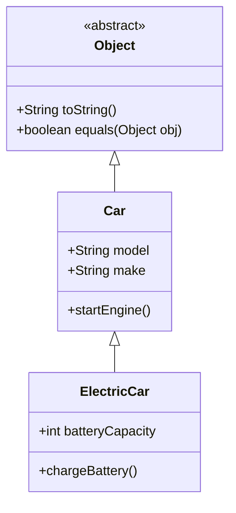
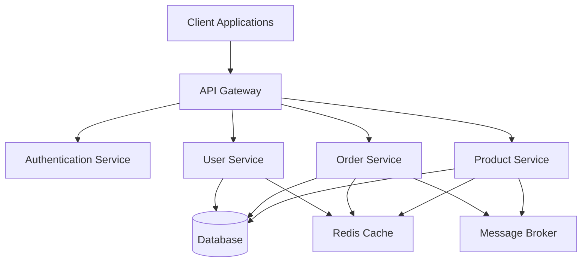

# Chapter 2 Java Fundamentals: Java Basics

## 2.1 Java Basics

### **Explanation**

Java serves as a foundational language in enterprise-level applications, renowned for its portability, robustness, and performance. For senior backend developers transitioning from languages like Node.js or TypeScript, understanding Java's basic constructs is crucial. This section delves into the core elements of Java, including its syntax, structure, data types, variables, operators, and control flow mechanisms. Mastery of these basics ensures a smooth transition to more advanced Java and Spring Boot topics.

#### **1. Syntax and Structure**

Java's syntax is influenced by C and C++, emphasizing object-oriented principles. Every Java application starts with a class definition, and the entry point is the `main` method. Proper indentation and adherence to naming conventions enhance code readability and maintainability.

**Key Elements:**
- **Classes and Objects**: The blueprint for creating instances.
- **Methods**: Define behaviors and functionalities.
- **Packages**: Organize classes into namespaces.

#### **2. Data Types and Variables**

Java is a statically-typed language, meaning variable types are declared explicitly. It offers primitive types (e.g., `int`, `double`, `char`) and reference types (e.g., `String`, custom objects). Understanding the difference between these types is essential for efficient memory management and performance optimization.

**Primitive Types:**
- **byte, short, int, long**: Represent integer values.
- **float, double**: Represent floating-point numbers.
- **char**: Represents single characters.
- **boolean**: Represents true or false values.

**Reference Types:**
- **Strings**: Immutable sequences of characters.
- **Arrays and Objects**: Collections of elements or instances of classes.

#### **3. Operators and Control Flow**

Java supports a variety of operators for arithmetic, comparison, logical operations, and more. Control flow statements manage the execution path of the program, enabling decision-making and iteration.

**Common Operators:**
- **Arithmetic**: `+`, `-`, `*`, `/`, `%`
- **Relational**: `==`, `!=`, `>`, `<`, `>=`, `<=`
- **Logical**: `&&`, `||`, `!`
- **Assignment**: `=`, `+=`, `-=`, etc.

**Control Flow Statements:**
- **Conditional Statements**: `if`, `else if`, `else`, `switch`
- **Loops**: `for`, `while`, `do-while`
- **Jump Statements**: `break`, `continue`, `return`

### **Code Example**

```java:path/to/java_fundamentals/JavaBasicsExample.java
// JavaBasicsExample.java
public class JavaBasicsExample {

    public static void main(String[] args) {
        // Variable Declaration and Initialization
        int number = 10;
        double price = 99.99;
        char grade = 'A';
        boolean isActive = true;
        String message = "Hello, Java!";

        // Arithmetic Operations
        int sum = number + 20;
        double totalPrice = price * 1.15; // Including 15% tax

        // Conditional Statement
        if (sum > 30) {
            System.out.println("Sum exceeds 30.");
        } else {
            System.out.println("Sum is 30 or below.");
        }

        // Loop Example
        for (int i = 0; i < 5; i++) {
            System.out.println("Iteration: " + i);
        }

        // Switch Case Example
        switch (grade) {
            case 'A':
                System.out.println("Excellent!");
                break;
            case 'B':
                System.out.println("Good job!");
                break;
            default:
                System.out.println("Keep trying!");
        }
    }
}
`````

**Explanation of the Code:**

- **Variable Declarations**: Demonstrates declaring variables of different primitive and reference types.
- **Arithmetic Operations**: Shows basic arithmetic using variables.
- **Conditional Statements**: Uses `if-else` to decide which message to print based on the sum.
- **Looping Constructs**: Implements a `for` loop to iterate and print messages.
- **Switch Case**: Utilizes a `switch` statement to respond based on the `grade` value.

**Comparison with Node.js:**

In Node.js, similar functionalities are achieved using JavaScript syntax. Here's a brief comparison:

`````javascript:path/to/nodejs_fundamentals/JavaVsNode.js.js
// JavaScript Example in Node.js

let number = 10;
let price = 99.99;
let grade = 'A';
let isActive = true;
let message = "Hello, Node.js!";

// Arithmetic Operations
let sum = number + 20;
let totalPrice = price * 1.15; // Including 15% tax

// Conditional Statement
if (sum > 30) {
    console.log("Sum exceeds 30.");
} else {
    console.log("Sum is 30 or below.");
}

// Loop Example
for (let i = 0; i < 5; i++) {
    console.log(`Iteration: ${i}`);
}

// Switch Case Example
switch (grade) {
    case 'A':
        console.log("Excellent!");
        break;
    case 'B':
        console.log("Good job!");
        break;
    default:
        console.log("Keep trying!");
}
`````

**Key Differences:**
- **Syntax**: Java requires explicit type declarations, whereas JavaScript is dynamically typed.
- **Class Structure**: Java enforces an object-oriented structure with classes, unlike the more flexible Node.js approach.
- **Compilation vs. Interpretation**: Java code is compiled to bytecode, ensuring type safety at compile-time, while Node.js executes JavaScript code directly.

### **Practical Application**

Understanding Java basics is pivotal when building scalable and maintainable enterprise applications. Here's how these fundamentals apply in real-world scenarios:

1. **Enterprise Systems**: Managing large codebases with multiple modules requires a solid grasp of Java's object-oriented principles, ensuring that components interact seamlessly.

2. **Performance Optimization**: Efficient use of data types and operators can significantly impact application performance, especially in compute-intensive tasks.

3. **Control Flow Management**: Complex business logic often necessitates intricate control flow structures. Mastery of loops and conditional statements ensures that applications handle various scenarios gracefully.

4. **Integration with Spring Boot**: Java basics form the backbone of Spring Boot applications. Understanding these fundamentals allows developers to leverage Spring's features effectively, such as dependency injection and aspect-oriented programming.

### **Advanced Insights**

Transitioning from Node.js or TypeScript to Java brings several advanced considerations:

#### **1. Type Safety and Compile-Time Checks**

Java's strict type system enforces type safety at compile-time, reducing runtime errors common in dynamically-typed languages like JavaScript.

**Best Practice:**
- **Explicit Type Declarations**: Always declare variable types explicitly to leverage compile-time checks.

```java:path/to/java_fundamentals/TypeSafetyExample.java
public class TypeSafetyExample {
    public static void main(String[] args) {
        int count = 5;
        // The following line would cause a compile-time error
        // count = "Five"; // Incompatible types: String cannot be converted to int
    }
}
```

#### **2. Memory Management**

Java manages memory through its garbage collector, abstracting away manual memory management. However, understanding memory allocation and object lifecycle is essential for optimizing performance.

**Optimization Technique:**
- **Avoid Unnecessary Object Creation**: Reuse objects where possible to minimize memory overhead.

```java:path/to/java_fundamentals/MemoryManagementExample.java
public class MemoryManagementExample {
    public static void main(String[] args) {
        // Inefficient: Creating multiple String objects
        String a = new String("Hello");
        String b = new String("Hello");

        // Efficient: Reusing String literals
        String c = "Hello";
        String d = "Hello"; // References the same object as 'c'
    }
}
```

#### **3. Concurrency Model**

Java offers robust concurrency support with threads and synchronization mechanisms, differing from Node.js's event-driven model.

**Best Practice:**
- **Use High-Level Concurrency Utilities**: Utilize `java.util.concurrent` package classes like `ExecutorService` for managing thread pools.

```java:path/to/java_fundamentals/ConcurrencyExample.java
import java.util.concurrent.ExecutorService;
import java.util.concurrent.Executors;

public class ConcurrencyExample {
    public static void main(String[] args) {
        ExecutorService executor = Executors.newFixedThreadPool(5);

        for(int i = 0; i < 10; i++) {
            executor.submit(() -> {
                System.out.println("Executing task in thread: " + Thread.currentThread().getName());
            });
        }

        executor.shutdown();
    }
}
```

#### **4. Exception Handling**

Java's exception handling mechanism ensures that errors are managed gracefully, promoting application stability.

**Best Practice:**
- **Use Specific Exceptions**: Catch and handle specific exceptions to address different error scenarios effectively.

```java:path/to/java_fundamentals/ExceptionHandlingExample.java
public class ExceptionHandlingExample {
    public static void main(String[] args) {
        try {
            int result = divide(10, 0);
        } catch (ArithmeticException ae) {
            System.out.println("Error: Division by zero is not allowed.");
        } finally {
            System.out.println("Operation completed.");
        }
    }

    public static int divide(int a, int b) {
        return a / b; // May throw ArithmeticException
    }
}
```

#### **5. Immutable Objects**

Java encourages the use of immutable objects to enhance thread safety and predictability.

**Best Practice:**
- **Use `final` Keyword**: Declare classes and variables as `final` to prevent modification after initialization.

```java:path/to/java_fundamentals/ImmutableExample.java
public final class ImmutableExample {
    private final String name;
    private final int age;

    public ImmutableExample(String name, int age) {
        this.name = name;
        this.age = age;
    }

    // No setters provided

    public String getName() {
        return name;
    }

    public int getAge() {
        return age;
    }
}
```

### **Common Pitfalls and How to Avoid Them**

1. **Null Pointer Exceptions (`NullPointerException`)**
   - **Issue**: Attempting to use an object reference that hasn't been initialized.
   - **Solution**: Always initialize objects and use Java's `Optional` class to handle nullable values gracefully.

   ```java:path/to/java_fundamentals/NullPointerExample.java
   public class NullPointerExample {
       public static void main(String[] args) {
           String text = null;
           try {
               System.out.println(text.length()); // Throws NullPointerException
           } catch (NullPointerException e) {
               System.out.println("Caught a NullPointerException!");
           }

           // Using Optional to prevent null issues
           Optional<String> optionalText = Optional.ofNullable(text);
           optionalText.ifPresent(s -> System.out.println(s.length()));
       }
   }
   ```

2. **Overusing Primitive Types**
   - **Issue**: Primitive types offer performance benefits but can lead to issues when objects are required (e.g., in collections).
   - **Solution**: Utilize wrapper classes (e.g., `Integer`, `Double`) when interfacing with collections or when objects are necessary.

   ```java:path/to/java_fundamentals/PrimitiveVsWrapper.java
   import java.util.ArrayList;
   import java.util.List;

   public class PrimitiveVsWrapper {
       public static void main(String[] args) {
           // Primitive array
           int[] numbers = {1, 2, 3, 4, 5};

           // Can't use primitives in Collections
           List<Integer> numberList = new ArrayList<>();
           for(int num : numbers) {
               numberList.add(num); // Autoboxing converts int to Integer
           }
       }
   }
   ```

3. **Improper Use of Static Members**
   - **Issue**: Overusing `static` can lead to code that's hard to test and maintain.
   - **Solution**: Limit the use of static members to constants or utility methods that don't require object state.

   ```java:path/to/java_fundamentals/StaticMemberExample.java
   public class StaticMemberExample {
       public static final double PI = 3.14159;

       public static double calculateCircumference(double radius) {
           return 2 * PI * radius;
       }

       public static void main(String[] args) {
           double circumference = calculateCircumference(5);
           System.out.println("Circumference: " + circumference);
       }
   }
   ```

4. **Ignoring Thread Safety**
   - **Issue**: Modifying shared data across multiple threads without proper synchronization can lead to inconsistent states.
   - **Solution**: Use synchronization mechanisms like `synchronized` blocks or high-level concurrency utilities to manage shared resources.

   ```java:path/to/java_fundamentals/ThreadSafetyExample.java
   public class ThreadSafetyExample {
       private int counter = 0;

       // Synchronized method to ensure thread safety
       public synchronized void increment() {
           counter++;
       }

       public static void main(String[] args) throws InterruptedException {
           ThreadSafetyExample example = new ThreadSafetyExample();
           Thread t1 = new Thread(() -> {
               for(int i = 0; i < 1000; i++) {
                   example.increment();
               }
           });

           Thread t2 = new Thread(() -> {
               for(int i = 0; i < 1000; i++) {
                   example.increment();
               }
           });

           t1.start();
           t2.start();
           t1.join();
           t2.join();

           System.out.println("Final Counter Value: " + example.counter);
       }
   }
   ```

### **Summary**

This section laid the groundwork for understanding Java's fundamental constructs essential for building robust, scalable, and maintainable enterprise applications. By mastering Java's syntax, data types, operators, and control flow mechanisms, senior backend developers can effectively transition from languages like Node.js and TypeScript to Java and Spring Boot. Emphasizing best practices and awareness of common pitfalls ensures that applications not only function correctly but also adhere to high standards of code quality and performance.

# 2.2 Object-Oriented Programming in Java

## Introduction

Object-Oriented Programming (OOP) is a cornerstone of modern software development, providing a structured and scalable approach to building complex systems. In Java, OOP principles are deeply integrated into the language, enabling developers to create robust, maintainable, and reusable code. This section delves into the advanced concepts of OOP in Java, equipping senior backend developers with the knowledge and skills necessary to architect large-scale, enterprise-level applications.

### Overview of Object-Oriented Programming

OOP revolves around the concept of "objects" which encapsulate data and behaviors. The four fundamental principles of OOP are:

1. **Encapsulation:** Bundling data with methods that operate on that data to restrict direct access from outside classes.
2. **Inheritance:** Creating new classes from existing ones to promote code reuse and establish hierarchical relationships.
3. **Polymorphism:** Allowing objects to be treated as instances of their parent class rather than their actual class, enabling multiple behaviors through a single interface.
4. **Abstraction:** Hiding complex implementation details and exposing only necessary components, simplifying interactions.

### Significance in Enterprise Java Development

In the realm of enterprise applications, OOP facilitates:

- **Scalability:** Modular design allows for components to be independently developed and scaled.
- **Maintainability:** Clear structure and encapsulation make codebases easier to manage and update.
- **Reusability:** Inheritance and polymorphism encourage the reuse of existing code, reducing redundancy.
- **Flexibility:** Abstract interfaces enable the system to adapt to changing requirements with minimal impact on existing components.



*Figure 2.2.1: Class Inheritance Diagram illustrating Object, Car, and ElectricCar classes*

## Encapsulation

Encapsulation is the mechanism of restricting direct access to some of an object's components, which can prevent the accidental modification of data. It promotes data hiding and safeguards the integrity of the data within an object.

### Detailed Explanation

In Java, encapsulation is achieved through:

- **Access Modifiers:** `private`, `protected`, `public`, and package-private control the visibility of class members.
- **Getter and Setter Methods:** Provide controlled access to the class's fields.

### Code Example

```java:path/to/java_fundamentals/EncapsulationExample.java
// EncapsulationExample.java
public class EncapsulationExample {
    // Private variables to restrict direct access
    private String name;
    private int age;

    // Public constructor
    public EncapsulationExample(String name, int age) {
        this.name = name;
        this.age = age;
    }

    // Getter for 'name'
    public String getName() {
        return name;
    }

    // Setter for 'name' with validation
    public void setName(String name) {
        if (name != null && !name.isEmpty()) {
            this.name = name;
        } else {
            throw new IllegalArgumentException("Name cannot be null or empty.");
        }
    }

    // Getter for 'age'
    public int getAge() {
        return age;
    }

    // Setter for 'age' with validation
    public void setAge(int age) {
        if (age > 0) {
            this.age = age;
        } else {
            throw new IllegalArgumentException("Age must be positive.");
        }
    }

    // Method to display information
    public void displayInfo() {
        System.out.println("Name: " + name + ", Age: " + age);
    }
}
```

**Explanation of the Code:**

- **Private Fields:** `name` and `age` are declared as private to prevent direct access.
- **Public Getters and Setters:** Provide controlled access to the fields with validation to ensure data integrity.
- **Constructor:** Initializes the object with valid data.
- **displayInfo Method:** Demonstrates accessing encapsulated data within the class.

### Practical Application

Encapsulation enhances maintainability and flexibility. For instance, if the internal representation of a class changes, as long as the public interface remains consistent, other parts of the application remain unaffected.

**Use Case:** Managing User Profiles

In an enterprise application, managing user profiles securely is crucial. Encapsulation ensures that sensitive user data is protected and accessed only through well-defined methods.

### Advanced Insights

- **Immutable Classes:** Creating classes where objects cannot be modified after creation by omitting setters and making fields `final`.
- **Encapsulation vs. Data Hiding:** While related, encapsulation also includes the implementation details and behaviors associated with the data, not just hiding it.

```java:path/to/java_fundamentals/ImmutableUser.java
// ImmutableUser.java
public final class ImmutableUser {
    private final String username;
    private final String email;

    public ImmutableUser(String username, String email) {
        if(username == null || email == null) {
            throw new IllegalArgumentException("Fields cannot be null");
        }
        this.username = username;
        this.email = email;
    }

    // Only getters, no setters
    public String getUsername() {
        return username;
    }

    public String getEmail() {
        return email;
    }

    // Demonstrates immutability
    @Override
    public String toString() {
        return "ImmutableUser{username='" + username + "', email='" + email + "'}";
    }
}
```

**Advantages of Immutable Classes:**

- **Thread-Safety:** Immutable objects are inherently thread-safe.
- **Simplicity:** Easier to understand and reason about as state doesn't change.
- **Hashing:** Safe to use as keys in hash-based collections.

## Inheritance

Inheritance allows a new class to inherit properties and behaviors from an existing class, promoting code reuse and establishing a hierarchical relationship between classes.

### Detailed Explanation

In Java, inheritance is implemented using the `extends` keyword. A subclass inherits accessible (non-private) members from its superclass.

- **Single Inheritance:** Java supports single inheritance; a class can inherit from only one superclass.
- **Method Overriding:** Subclasses can provide specific implementations of methods defined in the superclass.

### Code Example

```java:path/to/java_fundamentals/InheritanceExample.java
// InheritanceExample.java

// Superclass
public class Animal {
    protected String name;

    public Animal(String name) {
        this.name = name;
    }

    // Method to describe animal
    public void describe() {
        System.out.println("This is an animal named " + name);
    }
}

// Subclass
public class Dog extends Animal {
    private String breed;

    public Dog(String name, String breed) {
        super(name); // Call superclass constructor
        this.breed = breed;
    }

    // Overriding the describe method
    @Override
    public void describe() {
        System.out.println("This is a " + breed + " named " + name);
    }

    // Additional method specific to Dog
    public void bark() {
        System.out.println(name + " says: Woof!");
    }
}

// Usage
public class InheritanceTest {
    public static void main(String[] args) {
        Animal genericAnimal = new Animal("Creature");
        genericAnimal.describe(); // Output: This is an animal named Creature

        Dog dog = new Dog("Rex", "German Shepherd");
        dog.describe(); // Output: This is a German Shepherd named Rex
        dog.bark(); // Output: Rex says: Woof!
    }
}
```

**Explanation of the Code:**

- **Animal Class:** Acts as a superclass with a `describe` method.
- **Dog Class:** Subclass of `Animal`, overrides the `describe` method, and adds a new method `bark`.
- **InheritanceTest Class:** Demonstrates polymorphism by treating `Dog` as an `Animal`.

### Practical Application

Inheritance streamlines the development of related classes. In large-scale applications, it is common to have a base class for entities with shared attributes and behaviors.

**Use Case:** E-commerce Application

- **Base Class:** `Product` with common attributes like `id`, `name`, `price`.
- **Subclasses:** `Electronics`, `Books`, `Clothing`, each extending `Product` with specific attributes.

### Advanced Insights

- **Composition vs. Inheritance:** Favor composition over inheritance to reduce tight coupling and enhance flexibility.
- **Protected Members:** Use `protected` to allow subclasses access while preventing external access.
- **Final Classes and Methods:** Prevent classes from being subclassed or methods from being overridden to maintain integrity.

```java:path/to/java_fundamentals/FinalExample.java
// FinalExample.java

public final class Constants {
    public static final String APP_NAME = "EnterpriseApp";

    // Attempting to extend this class will result in a compilation error
}

// Unreachable subclass
// public class ExtendedConstants extends Constants {} // Error: Cannot inherit from final 'Constants'
```

**Note on Best Practices:**

- **Prefer Interfaces and Composition:** When multiple behaviors are needed, interfaces combined with composition provide more flexibility than rigid inheritance hierarchies.
- **Avoid Deep Inheritance Trees:** Excessive inheritance can lead to maintenance challenges and decreased code readability.

## Polymorphism

Polymorphism permits objects to be treated as instances of their parent class rather than their actual class, enabling a single interface to represent multiple underlying forms (types).

### Detailed Explanation

Polymorphism is achieved through method overriding and interfaces in Java.

- **Method Overriding:** Subclasses provide specific implementations of methods declared in their superclass.
- **Interfaces:** Define contracts that classes can implement, allowing for multiple polymorphic behaviors across different class hierarchies.

### Code Example

```java:path/to/java_fundamentals/PolymorphismExample.java
// PolymorphismExample.java

// Base Class
public abstract class Shape {
    public abstract double area();
}

// Subclass 1
public class Circle extends Shape {
    private double radius;

    public Circle(double radius) {
        this.radius = radius;
    }

    // Implementing area method
    @Override
    public double area() {
        return Math.PI * radius * radius;
    }
}

// Subclass 2
public class Rectangle extends Shape {
    private double length;
    private double width;

    public Rectangle(double length, double width) {
        this.length = length;
        this.width = width;
    }

    // Implementing area method
    @Override
    public double area() {
        return length * width;
    }
}

// Usage
public class PolymorphismTest {
    public static void main(String[] args) {
        Shape shape1 = new Circle(5.0); // Upcasting
        Shape shape2 = new Rectangle(4.0, 6.0); // Upcasting

        System.out.println("Area of Circle: " + shape1.area()); // Output: Area of Circle: 78.53981633974483
        System.out.println("Area of Rectangle: " + shape2.area()); // Output: Area of Rectangle: 24.0
    }
}
```

**Explanation of the Code:**

- **Shape Class:** An abstract base class with an abstract method `area`.
- **Circle and Rectangle Classes:** Subclasses that provide concrete implementations of `area`.
- **PolymorphismTest Class:** Demonstrates polymorphism by treating different shapes as instances of `Shape` and invoking their specific `area` implementations.

### Practical Application

Polymorphism allows for flexible and extensible code. In enterprise applications, it facilitates implementing strategies, handling various processing tasks, and integrating with diverse systems.

**Use Case:** Payment Processing System

- **Base Interface:** `PaymentProcessor` with a method `processPayment()`.
- **Implementations:** `CreditCardProcessor`, `PayPalProcessor`, `BankTransferProcessor`, each implementing `processPayment` differently.

### Advanced Insights

- **Dynamic Binding:** Java determines the method implementation at runtime based on the object's actual class.
- **Inversion of Control (IoC):** Combined with polymorphism, IoC patterns enable decoupled and testable code.
- **Default Methods in Interfaces (Java 8+):** Allow method implementations within interfaces, providing backward compatibility and reusable code.

```java:path/to/java_fundamentals/DefaultMethodExample.java
// DefaultMethodExample.java

public interface Logger {
    void logInfo(String message);

    // Default method
    default void logWarning(String message) {
        System.out.println("WARNING: " + message);
    }
}

public class ConsoleLogger implements Logger {
    @Override
    public void logInfo(String message) {
        System.out.println("INFO: " + message);
    }

    // Uses default logWarning method
}

public class LoggerTest {
    public static void main(String[] args) {
        Logger logger = new ConsoleLogger();
        logger.logInfo("Application started.");
        logger.logWarning("Low disk space.");
    }
}
```

**Advantages of Default Methods:**

- **Enhances Interface Evolution:** Adding new methods without breaking existing implementations.
- **Reusability:** Provides common method logic that can be shared across multiple implementations.

## Abstraction

Abstraction simplifies complex systems by exposing only the necessary components and hiding the implementation details. It allows developers to focus on what an object does rather than how it does it.

### Detailed Explanation

In Java, abstraction is achieved through:

- **Abstract Classes:** Can contain both abstract methods (without implementation) and concrete methods (with implementation).
- **Interfaces:** Define contracts with abstract methods that implementing classes must fulfill.

### Code Example

```java:path/to/java_fundamentals/AbstractionExample.java
// AbstractionExample.java

// Abstract Class
public abstract class Vehicle {
    protected String model;

    public Vehicle(String model) {
        this.model = model;
    }

    // Abstract method
    public abstract void drive();

    // Concrete method
    public void displayModel() {
        System.out.println("Model: " + model);
    }
}

// Concrete Subclass
public class Sedan extends Vehicle {
    public Sedan(String model) {
        super(model);
    }

    @Override
    public void drive() {
        System.out.println(model + " is driving smoothly.");
    }
}

// Interface
public interface Flyable {
    void fly();
}

// Implementation of Interface
public class Airplane implements Flyable {
    @Override
    public void fly() {
        System.out.println("Airplane is flying at cruising altitude.");
    }
}

// Usage
public class AbstractionTest {
    public static void main(String[] args) {
        Vehicle sedan = new Sedan("Toyota Camry");
        sedan.displayModel(); // Output: Model: Toyota Camry
        sedan.drive(); // Output: Toyota Camry is driving smoothly.

        Flyable airplane = new Airplane();
        airplane.fly(); // Output: Airplane is flying at cruising altitude.
    }
}
```

**Explanation of the Code:**

- **Vehicle Class:** An abstract class with an abstract method `drive` and a concrete method `displayModel`.
- **Sedan Class:** Extends `Vehicle` and provides an implementation for `drive`.
- **Flyable Interface:** Defines a `fly` method.
- **Airplane Class:** Implements the `Flyable` interface and provides an implementation for `fly`.
- **AbstractionTest Class:** Demonstrates the usage of abstract classes and interfaces.

### Practical Application

Abstraction is pivotal in designing scalable systems. It enables the creation of flexible APIs and services where the underlying implementations can evolve without impacting the consumers.

**Use Case:** Notification System

- **Abstract Component:** `NotificationService` abstract class defining methods like `sendNotification`.
- **Concrete Implementations:** `EmailNotificationService`, `SMSNotificationService`, `PushNotificationService` implementing the delivery mechanisms.

### Advanced Insights

- **Multiple Inheritance via Interfaces:** Java allows a class to implement multiple interfaces, providing a form of multiple inheritance while avoiding the complexities associated with it.
- **Default and Static Methods in Interfaces:** Enhance abstraction by providing implementation logic within interfaces.
- **Separation of Concerns:** Abstraction aids in dividing a system into distinct sections, each handling a specific aspect.

```java:path/to/java_fundamentals/MultiInterfaceExample.java
// MultiInterfaceExample.java

public interface Drivable {
    void drive();
}

public interface Sailable {
    void sail();
}

public class AmphibiousVehicle implements Drivable, Sailable {
    @Override
    public void drive() {
        System.out.println("AmphibiousVehicle is driving on land.");
    }

    @Override
    public void sail() {
        System.out.println("AmphibiousVehicle is sailing on water.");
    }
}

public class MultiInterfaceTest {
    public static void main(String[] args) {
        AmphibiousVehicle amphibious = new AmphibiousVehicle();
        amphibious.drive(); // Output: AmphibiousVehicle is driving on land.
        amphibious.sail(); // Output: AmphibiousVehicle is sailing on water.
    }
}
```

**Benefits of Using Multiple Interfaces:**

- **Enhanced Flexibility:** Allows classes to exhibit multiple behaviors without the limitations of single inheritance.
- **Testability:** Facilitates mocking and testing specific behaviors independently.

## Best Practices and Common Pitfalls

### Best Practices

1. **Favor Composition over Inheritance:**
   - Composition offers greater flexibility and promotes loose coupling.
   - Example: Instead of a class extending another, include instances of other classes as fields.

   ```java:path/to/java_fundamentals/CompositionExample.java
   // CompositionExample.java
   public class Engine {
       public void start() {
           System.out.println("Engine started.");
       }
   }

   public class Car {
       private Engine engine;

       public Car() {
           this.engine = new Engine();
       }

       public void startCar() {
           engine.start();
           System.out.println("Car is running.");
       }
   }

   public class CompositionTest {
       public static void main(String[] args) {
           Car car = new Car();
           car.startCar();
       }
   }
   ```

2. **Use Interfaces to Define Contracts:**
   - Decouple implementation from behavior.
   - Facilitate multiple implementations and easier testing.

3. **Apply SOLID Principles:**
   - **Single Responsibility:** Classes should have only one reason to change.
   - **Open/Closed:** Classes should be open for extension but closed for modification.
   - **Liskov Substitution:** Subclasses should be substitutable for their base classes.
   - **Interface Segregation:** Prefer many specific interfaces over one general-purpose interface.
   - **Dependency Inversion:** Depend on abstractions, not on concrete implementations.

4. **Leverage Design Patterns:**
   - Utilize established design patterns like Factory, Singleton, Observer to solve common design problems.

5. **Encapsulate Data Properly:**
   - Use private fields with public getters and setters.
   - Implement validation within setters to maintain data integrity.

### Common Pitfalls

1. **Improper Use of Inheritance:**
   - **Problem:** Overusing inheritance can lead to rigid and tightly coupled code.
   - **Solution:** Prefer composition and use inheritance only when there is a clear "is-a" relationship.

2. **Ignoring Encapsulation:**
   - **Problem:** Making fields public can lead to unintended modifications and fragile code.
   - **Solution:** Keep fields private and provide controlled access through methods.

3. **Violating the Liskov Substitution Principle:**
   - **Problem:** Subclasses that alter expected behavior can cause runtime issues.
   - **Solution:** Ensure that subclasses adhere to the contracts established by their superclasses or interfaces.

4. **Overcomplicating with Design Patterns:**
   - **Problem:** Implementing patterns unnecessarily can introduce complexity.
   - **Solution:** Apply patterns judiciously where they offer clear benefits.

5. **Mixing Concerns:**
   - **Problem:** Combining unrelated functionalities in a single class can reduce maintainability.
   - **Solution:** Adhere to the Single Responsibility Principle and maintain separation of concerns.

```java:path/to/java_fundamentals/LiskovSubstitutionViolation.java
// LiskovSubstitutionViolation.java

// Base Class
public class Bird {
    public void fly() {
        System.out.println("Bird is flying.");
    }
}

// Subclass
public class Ostrich extends Bird {
    @Override
    public void fly() {
        throw new UnsupportedOperationException("Ostriches can't fly.");
    }
}

// Usage
public class LiskovTest {
    public static void main(String[] args) {
        Bird bird = new Ostrich();
        bird.fly(); // Throws UnsupportedOperationException
    }
}
```

**Issue:** Ostrich is a Bird but cannot fly, violating the Liskov Substitution Principle.

**Solution:** Reorganize the class hierarchy to accurately represent capabilities.

```java:path/to/java_fundamentals/CorrectBirdHierarchy.java
// CorrectBirdHierarchy.java

public interface Flyable {
    void fly();
}

public abstract class Bird {
    protected String name;

    public Bird(String name) {
        this.name = name;
    }

    public abstract void move();
}

public class Sparrow extends Bird implements Flyable {
    public Sparrow(String name) {
        super(name);
    }

    @Override
    public void fly() {
        System.out.println(name + " is flying.");
    }

    @Override
    public void move() {
        fly();
    }
}

public class Ostrich extends Bird {
    public Ostrich(String name) {
        super(name);
    }

    @Override
    public void move() {
        System.out.println(name + " is running.");
    }
}
```

**Advantages of Correct Hierarchy:**

- **Adherence to LSP:** Subclasses only have behaviors they can genuinely perform.
- **Clear Separation of Capabilities:** Flyable behavior is segregated into its own interface.

## Polymorphism in Practice

Understanding polymorphism is essential for creating flexible and dynamic codebases. Polymorphism allows methods to process objects differently based on their actual class, enabling a single interface to represent multiple underlying forms.

### Advanced Code Example

```java:path/to/java_fundamentals/PersistenceExample.java
// PersistenceExample.java

import java.util.ArrayList;
import java.util.List;

// Generic Repository Interface
public interface Repository<T> {
    void save(T entity);
    T findById(int id);
    List<T> findAll();
    void delete(T entity);
}

// Concrete Repository for User
public class UserRepository implements Repository<User> {
    private List<User> users = new ArrayList<>();

    @Override
    public void save(User user) {
        users.add(user);
        System.out.println("User saved: " + user.getName());
    }

    @Override
    public User findById(int id) {
        return users.stream()
                    .filter(u -> u.getId() == id)
                    .findFirst()
                    .orElse(null);
    }

    @Override
    public List<User> findAll() {
        return users;
    }

    @Override
    public void delete(User user) {
        users.remove(user);
        System.out.println("User deleted: " + user.getName());
    }
}

// Concrete Repository for Product
public class ProductRepository implements Repository<Product> {
    private List<Product> products = new ArrayList<>();

    @Override
    public void save(Product product) {
        products.add(product);
        System.out.println("Product saved: " + product.getName());
    }

    @Override
    public Product findById(int id) {
        return products.stream()
                       .filter(p -> p.getId() == id)
                       .findFirst()
                       .orElse(null);
    }

    @Override
    public List<Product> findAll() {
        return products;
    }

    @Override
    public void delete(Product product) {
        products.remove(product);
        System.out.println("Product deleted: " + product.getName());
    }
}

// Usage
public class PersistenceTest {
    public static void main(String[] args) {
        Repository<User> userRepo = new UserRepository();
        User user = new User(1, "Alice");
        userRepo.save(user);
        userRepo.findAll().forEach(u -> System.out.println(u.getName()));

        Repository<Product> productRepo = new ProductRepository();
        Product product = new Product(101, "Laptop");
        productRepo.save(product);
        productRepo.findAll().forEach(p -> System.out.println(p.getName()));
    }
}
```

**Explanation of the Code:**

- **Repository Interface:** A generic interface defining CRUD operations.
- **UserRepository and ProductRepository:** Concrete implementations managing `User` and `Product` entities respectively.
- **PersistenceTest Class:** Demonstrates polymorphic behavior by using the `Repository` interface to interact with different entity types.

### Practical Application

Polymorphism simplifies the implementation of generic services and utilities, allowing for scalable and maintainable code architectures.

**Use Case:** Notification Dispatcher

- **Interface:** `NotificationService` with a method `send(Notification notification)`.
- **Implementations:** `EmailNotificationService`, `SMSNotificationService`, `PushNotificationService`.
- **Dispatcher:** Uses polymorphism to send notifications without knowing the underlying service details.

### Advanced Insights

- **Type Erasure in Generics:** Java's type erasure feature can complicate reflection and certain generic operations, requiring careful design considerations.
- **Covariance and Contravariance:** Understanding these concepts is crucial for designing flexible APIs and interacting with generic types effectively.

```java:path/to/java_fundamentals/CovarianceContravarianceExample.java
// CovarianceContravarianceExample.java

import java.util.List;
import java.util.ArrayList;

public class CovarianceContravarianceExample {
    public static void main(String[] args) {
        List<? extends Number> covariantList = new ArrayList<Integer>();
        // covariantList.add(10); // Error: Cannot add to a covariant list

        List<? super Integer> contravariantList = new ArrayList<Number>();
        contravariantList.add(20); // Allowed
        // Integer num = contravariantList.get(0); // Error: Cannot guarantee the type
    }
}
```

**Key Points:**

- **Covariance (`? extends Type`):** Allows reading objects as their base type but restricts writing.
- **Contravariance (`? super Type`):** Allows writing objects up to the base type but restricts reading.

## Abstraction in Enterprise Systems

Abstraction plays a critical role in designing large-scale enterprise systems, fostering modularity and ease of maintenance.

### Architectural Diagram



*Figure 2.2.2: High-Level Architecture of an Enterprise System Utilizing Abstraction*

### Practical Application: Service-Oriented Architecture (SOA)

Abstraction facilitates the creation of discrete services that interact through well-defined interfaces, enhancing scalability and maintainability.

**Components:**

- **API Gateway:** Acts as a single entry point, abstracting the underlying microservices.
- **Microservices:** Each service encapsulates specific business logic and interacts with databases and caches independently.
- **Messaging System:** Enables asynchronous communication, decoupling services and enhancing system resilience.

### Advanced Insights

- **Layered Architecture:** Abstraction helps in implementing layered architectures (e.g., Presentation, Business Logic, Data Access) by segregating responsibilities.
- **Dependency Injection (DI):** Combined with abstraction, DI promotes loose coupling and easier testing by injecting dependencies rather than hardcoding them.
- **Service Contracts:** Define clear interfaces for services, ensuring that changes within a service do not ripple through the entire system.

```java:path/to/java_fundamentals/DependencyInjectionExample.java
// DependencyInjectionExample.java

import org.springframework.beans.factory.annotation.Autowired;
import org.springframework.stereotype.Service;

// Service Interface
public interface NotificationService {
    void sendNotification(String message);
}

// Email Implementation
@Service
public class EmailNotificationService implements NotificationService {
    @Override
    public void sendNotification(String message) {
        // Logic to send email
        System.out.println("Email sent with message: " + message);
    }
}

// User Service Utilizing DI
@Service
public class UserService {
    private final NotificationService notificationService;

    @Autowired
    public UserService(NotificationService notificationService) {
        this.notificationService = notificationService;
    }

    public void registerUser(String username) {
        // Registration logic
        System.out.println("User " + username + " registered.");
        notificationService.sendNotification("Welcome " + username + "!");
    }
}
```

**Explanation of the Code:**

- **NotificationService Interface:** Abstracts the notification mechanism.
- **EmailNotificationService:** Concrete implementation of `NotificationService`.
- **UserService:** Depends on `NotificationService`, injected via constructor, promoting loose coupling.

**Benefits:**

- **Flexibility:** Easily swap out implementations without modifying dependent classes.
- **Testability:** Mock services can be injected for testing purposes.
- **Maintainability:** Changes in service implementations do not affect consumers.

## Comparative Analysis with Node.js and TypeScript

Transitioning from Node.js or TypeScript to Java involves adapting to a strongly-typed, class-based OOP environment. Here's a comparative look at similar functionalities.

### Class Definition

**Java:**

```java:path/to/java_fundamentals/JavaClassExample.java
// JavaClassExample.java
public class User {
    private String name;
    private int age;

    // Constructor
    public User(String name, int age) {
        this.name = name;
        this.age = age;
    }

    // Getter
    public String getName() {
        return name;
    }

    // Setter with validation
    public void setAge(int age) {
        if(age > 0){
            this.age = age;
        }
    }

    // Method
    public void displayInfo() {
        System.out.println("Name: " + name + ", Age: " + age);
    }
}
```

**TypeScript:**

```typescript:path/to/typeScript_fundamentals/User.ts
// User.ts
class User {
    private name: string;
    private age: number;

    constructor(name: string, age: number){
        this.name = name;
        this.age = age;
    }

    getName(): string {
        return this.name;
    }

    setAge(age: number): void {
        if(age > 0){
            this.age = age;
        }
    }

    displayInfo(): void {
        console.log(`Name: ${this.name}, Age: ${this.age}`);
    }
}
```

*Similarities:*

- Both use classes to define objects with properties and methods.
- Access modifiers (`private`) to encapsulate data.
- Constructors to initialize object state.
- Getters and setters to manage property access.

*Differences:*

- **Type Declarations:** Java requires explicit type declarations, whereas TypeScript offers type inference but also allows explicit typing.
- **Method Syntax:** Java uses traditional method signatures, while TypeScript leverages access modifiers within class definitions more seamlessly.
- **Console Output:** Java uses `System.out.println`, whereas TypeScript uses `console.log`.

### Inheritance and Interfaces

**Java:**

```java:path/to/java_fundamentals/JavaInheritanceExample.java
public interface Payable {
    void processPayment(double amount);
}

public class Invoice implements Payable {
    @Override
    public void processPayment(double amount) {
        System.out.println("Processing invoice payment of $" + amount);
    }
}

public class Salary implements Payable {
    @Override
    public void processPayment(double amount) {
        System.out.println("Processing salary payment of $" + amount);
    }
}
```

**TypeScript:**

```typescript:path/to/typeScript_fundamentals/TypeScriptInheritanceExample.ts
interface Payable {
    processPayment(amount: number): void;
}

class Invoice implements Payable {
    processPayment(amount: number): void {
        console.log(`Processing invoice payment of $${amount}`);
    }
}

class Salary implements Payable {
    processPayment(amount: number): void {
        console.log(`Processing salary payment of $${amount}`);
    }
}
```

*Similarities:*

- Both utilize interfaces to define contracts.
- Classes implement interfaces to provide concrete behavior.

*Differences:*

- **Default Methods:** Java interfaces can include default methods with implementations, whereas TypeScript interfaces cannot.
- **Method Overrides:** Java requires the `@Override` annotation, which is not present in TypeScript.
- **Access Modifiers in Interfaces:** Java supports access modifiers within interfaces, adding flexibility to default and static methods.

### Method Overloading and Overriding

**Java:**

```java:path/to/java_fundamentals/MethodOverloadingOverriding.java
public class Calculator {
    // Method Overloading
    public int add(int a, int b){
        return a + b;
    }

    public double add(double a, double b){
        return a + b;
    }

    // Method Overriding
    public void display() {
        System.out.println("Calculator Display");
    }
}

public class AdvancedCalculator extends Calculator {
    @Override
    public void display() {
        System.out.println("Advanced Calculator Display");
    }
}
```

**TypeScript:**

```typescript:path/to/typeScript_fundamentals/TypeScriptMethodOverloading.ts
class Calculator {
    // Method Overloading is not directly supported
    add(a: number, b: number): number;
    add(a: number, b: string): string;
    add(a: any, b: any): any {
        return a + b;
    }

    display(): void {
        console.log("Calculator Display");
    }
}

class AdvancedCalculator extends Calculator {
    display(): void {
        console.log("Advanced Calculator Display");
    }
}
```

*Similarities:*

- Both languages allow method overriding to provide specific implementations in subclasses.
- Method overloading in Java is more straightforward compared to TypeScript's approach.

*Differences:*

- **Method Overloading:** Java natively supports method overloading through different parameter types, while TypeScript uses union types and type guards to achieve similar functionality.
- **Override Annotation:** Java uses the `@Override` annotation for clarity and compile-time checking, whereas TypeScript does not have an equivalent feature.
- **Type Safety:** Java's method overloading ensures type safety at compile-time, while TypeScript's approach relies on runtime checks within the method body.

## Comparative Analysis with Node.js and TypeScript

Transitioning from Node.js or TypeScript to Java involves adapting to a strongly-typed, class-based OOP environment. Here's a comparative look at similar functionalities.

### Class Definition

**Java:**

```java:path/to/java_fundamentals/JavaClassExample.java
// JavaClassExample.java
public class User {
    private String name;
    private int age;

    // Constructor
    public User(String name, int age) {
        this.name = name;
        this.age = age;
    }

    // Getter
    public String getName() {
        return name;
    }

    // Setter with validation
    public void setAge(int age) {
        if(age > 0){
            this.age = age;
        }
    }

    // Method
    public void displayInfo() {
        System.out.println("Name: " + name + ", Age: " + age);
    }
}
```

**TypeScript:**

```typescript:path/to/typeScript_fundamentals/User.ts
// User.ts
class User {
    private name: string;
    private age: number;

    constructor(name: string, age: number){
        this.name = name;
        this.age = age;
    }

    getName(): string {
        return this.name;
    }

    setAge(age: number): void {
        if(age > 0){
            this.age = age;
        }
    }

    displayInfo(): void {
        console.log(`Name: ${this.name}, Age: ${this.age}`);
    }
}
```

*Similarities:*

- Both use classes to define objects with properties and methods.
- Access modifiers (`private`) to encapsulate data.
- Constructors to initialize object state.
- Getters and setters to manage property access.

*Differences:*

- **Type Declarations:** Java requires explicit type declarations, whereas TypeScript offers type inference but also allows explicit typing.
- **Method Syntax:** Java uses traditional method signatures, while TypeScript leverages access modifiers within class definitions more seamlessly.
- **Console Output:** Java uses `System.out.println`, whereas TypeScript uses `console.log`.

### Inheritance and Interfaces

**Java:**

```java:path/to/java_fundamentals/JavaInheritanceExample.java
public interface Payable {
    void processPayment(double amount);
}

public class Invoice implements Payable {
    @Override
    public void processPayment(double amount) {
        System.out.println("Processing invoice payment of $" + amount);
    }
}

public class Salary implements Payable {
    @Override
    public void processPayment(double amount) {
        System.out.println("Processing salary payment of $" + amount);
    }
}
```

**TypeScript:**

```typescript:path/to/typeScript_fundamentals/TypeScriptInheritanceExample.ts
interface Payable {
    processPayment(amount: number): void;
}

class Invoice implements Payable {
    processPayment(amount: number): void {
        console.log(`Processing invoice payment of $${amount}`);
    }
}

class Salary implements Payable {
    processPayment(amount: number): void {
        console.log(`Processing salary payment of $${amount}`);
    }
}
```

*Similarities:*

- Both utilize interfaces to define contracts.
- Classes implement interfaces to provide concrete behavior.

*Differences:*

- **Default Methods:** Java interfaces can include default methods with implementations, whereas TypeScript interfaces cannot.
- **Method Overrides:** Java requires the `@Override` annotation, which is not present in TypeScript.
- **Access Modifiers in Interfaces:** Java supports access modifiers within interfaces, adding flexibility to default and static methods.

### Method Overloading and Overriding

**Java:**

```java:path/to/java_fundamentals/MethodOverloadingOverriding.java
public class Calculator {
    // Method Overloading
    public int add(int a, int b){
        return a + b;
    }

    public double add(double a, double b){
        return a + b;
    }

    // Method Overriding
    public void display() {
        System.out.println("Calculator Display");
    }
}

public class AdvancedCalculator extends Calculator {
    @Override
    public void display() {
        System.out.println("Advanced Calculator Display");
    }
}
```

**TypeScript:**

```typescript:path/to/typeScript_fundamentals/TypeScriptMethodOverloading.ts
class Calculator {
    // Method Overloading is not directly supported
    add(a: number, b: number): number;
    add(a: number, b: string): string;
    add(a: any, b: any): any {
        return a + b;
    }

    display(): void {
        console.log("Calculator Display");
    }
}

class AdvancedCalculator extends Calculator {
    display(): void {
        console.log("Advanced Calculator Display");
    }
}
```

*Similarities:*

- Both languages allow method overriding to provide specific implementations in subclasses.
- Method overloading in Java is more straightforward compared to TypeScript's approach.

*Differences:*

- **Method Overloading:** Java natively supports method overloading through different parameter types, while TypeScript uses union types and type guards to achieve similar functionality.
- **Override Annotation:** Java uses the `@Override` annotation for clarity and compile-time checking, whereas TypeScript does not have an equivalent feature.
- **Type Safety:** Java's method overloading ensures type safety at compile-time, while TypeScript's approach relies on runtime checks within the method body.

## Comparative Analysis with Node.js and TypeScript

Transitioning from Node.js or TypeScript to Java involves adapting to a strongly-typed, class-based OOP environment. Here's a comparative look at similar functionalities.

### Class Definition

**Java:**

```java:path/to/java_fundamentals/JavaClassExample.java
// JavaClassExample.java
public class User {
    private String name;
    private int age;

    // Constructor
    public User(String name, int age) {
        this.name = name;
        this.age = age;
    }

    // Getter
    public String getName() {
        return name;
    }

    // Setter with validation
    public void setAge(int age) {
        if(age > 0){
            this.age = age;
        }
    }

    // Method
    public void displayInfo() {
        System.out.println("Name: " + name + ", Age: " + age);
    }
}
```

**TypeScript:**

```typescript:path/to/typeScript_fundamentals/User.ts
// User.ts
class User {
    private name: string;
    private age: number;

    constructor(name: string, age: number){
        this.name = name;
        this.age = age;
    }

    getName(): string {
        return this.name;
    }

    setAge(age: number): void {
        if(age > 0){
            this.age = age;
        }
    }

    displayInfo(): void {
        console.log(`Name: ${this.name}, Age: ${this.age}`);
    }
}
```

*Similarities:*

- Both use classes to define objects with properties and methods.
- Access modifiers (`private`) to encapsulate data.
- Constructors to initialize object state.
- Getters and setters to manage property access.

*Differences:*

- **Type Declarations:** Java requires explicit type declarations, whereas TypeScript offers type inference but also allows explicit typing.
- **Method Syntax:** Java uses traditional method signatures, while TypeScript leverages access modifiers within class definitions more seamlessly.
- **Console Output:** Java uses `System.out.println`, whereas TypeScript uses `console.log`.

### Inheritance and Interfaces

**Java:**

```java:path/to/java_fundamentals/JavaInheritanceExample.java
public interface Payable {
    void processPayment(double amount);
}

public class Invoice implements Payable {
    @Override
    public void processPayment(double amount) {
        System.out.println("Processing invoice payment of $" + amount);
    }
}

public class Salary implements Payable {
    @Override
    public void processPayment(double amount) {
        System.out.println("Processing salary payment of $" + amount);
    }
}
```

**TypeScript:**

```typescript:path/to/typeScript_fundamentals/TypeScriptInheritanceExample.ts
interface Payable {
    processPayment(amount: number): void;
}

class Invoice implements Payable {
    processPayment(amount: number): void {
        console.log(`Processing invoice payment of $${amount}`);
    }
}

class Salary implements Payable {
    processPayment(amount: number): void {
        console.log(`Processing salary payment of $${amount}`);
    }
}
```

*Similarities:*

- Both utilize interfaces to define contracts.
- Classes implement interfaces to provide concrete behavior.

*Differences:*

- **Default Methods:** Java interfaces can include default methods with implementations, whereas TypeScript interfaces cannot.
- **Method Overrides:** Java requires the `@Override` annotation, which is not present in TypeScript.
- **Access Modifiers in Interfaces:** Java supports access modifiers within interfaces, adding flexibility to default and static methods.

### Method Overloading and Overriding

**Java:**

```java:path/to/java_fundamentals/MethodOverloadingOverriding.java
public class Calculator {
    // Method Overloading
    public int add(int a, int b){
        return a + b;
    }

    public double add(double a, double b){
        return a + b;
    }

    // Method Overriding
    public void display() {
        System.out.println("Calculator Display");
    }
}

public class AdvancedCalculator extends Calculator {
    @Override
    public void display() {
        System.out.println("Advanced Calculator Display");
    }
}
```

**TypeScript:**

```typescript:path/to/typeScript_fundamentals/TypeScriptMethodOverloading.ts
class Calculator {
    // Method Overloading is not directly supported
    add(a: number, b: number): number;
    add(a: number, b: string): string;
    add(a: any, b: any): any {
        return a + b;
    }

    display(): void {
        console.log("Calculator Display");
    }
}

class AdvancedCalculator extends Calculator {
    display(): void {
        console.log("Advanced Calculator Display");
    }
}
```

*Similarities:*

- Both languages allow method overriding to provide specific implementations in subclasses.
- Method overloading in Java is more straightforward compared to TypeScript's approach.

*Differences:*

- **Method Overloading:** Java natively supports method overloading through different parameter types, while TypeScript uses union types and type guards to achieve similar functionality.
- **Override Annotation:** Java uses the `@Override` annotation for clarity and compile-time checking, whereas TypeScript does not have an equivalent feature.
- **Type Safety:** Java's method overloading ensures type safety at compile-time, while TypeScript's approach relies on runtime checks within the method body.

## Polymorphism in Practice

Understanding polymorphism is essential for creating flexible and dynamic codebases. Polymorphism allows methods to process objects differently based on their actual class, enabling a single interface to represent multiple underlying forms.

### Advanced Code Example

```java:path/to/java_fundamentals/PersistenceExample.java
// PersistenceExample.java

import java.util.ArrayList;
import java.util.List;

// Generic Repository Interface
public interface Repository<T> {
    void save(T entity);
    T findById(int id);
    List<T> findAll();
    void delete(T entity);
}

// Concrete Repository for User
public class UserRepository implements Repository<User> {
    private List<User> users = new ArrayList<>();

    @Override
    public void save(User user) {
        users.add(user);
        System.out.println("User saved: " + user.getName());
    }

    @Override
    public User findById(int id) {
        return users.stream()
                    .filter(u -> u.getId() == id)
                    .findFirst()
                    .orElse(null);
    }

    @Override
    public List<User> findAll() {
        return users;
    }

    @Override
    public void delete(User user) {
        users.remove(user);
        System.out.println("User deleted: " + user.getName());
    }
}

// Concrete Repository for Product
public class ProductRepository implements Repository<Product> {
    private List<Product> products = new ArrayList<>();

    @Override
    public void save(Product product) {
        products.add(product);
        System.out.println("Product saved: " + product.getName());
    }

    @Override
    public Product findById(int id) {
        return products.stream()
                       .filter(p -> p.getId() == id)
                       .findFirst()
                       .orElse(null);
    }

    @Override
    public List<Product> findAll() {
        return products;
    }

    @Override
    public void delete(Product product) {
        products.remove(product);
        System.out.println("Product deleted: " + product.getName());
    }
}

// Usage
public class PersistenceTest {
    public static void main(String[] args) {
        Repository<User> userRepo = new UserRepository();
        User user = new User(1, "Alice");
        userRepo.save(user);
        userRepo.findAll().forEach(u -> System.out.println(u.getName()));

        Repository<Product> productRepo = new ProductRepository();
        Product product = new Product(101, "Laptop");
        productRepo.save(product);
        productRepo.findAll().forEach(p -> System.out.println(p.getName()));
    }
}
```

**Explanation of the Code:**

- **Repository Interface:** A generic interface defining CRUD operations.
- **UserRepository and ProductRepository:** Concrete implementations managing `User` and `Product` entities respectively.
- **PersistenceTest Class:** Demonstrates polymorphic behavior by using the `Repository` interface to interact with different entity types.

### Practical Application

Polymorphism simplifies the implementation of generic services and utilities, allowing for scalable and maintainable code architectures.

**Use Case:** Notification Dispatcher

- **Interface:** `NotificationService` with a method `send(Notification notification)`.
- **Implementations:** `EmailNotificationService`, `SMSNotificationService`, `PushNotificationService`.
- **Dispatcher:** Uses polymorphism to send notifications without knowing the underlying service details.

### Advanced Insights

- **Type Erasure in Generics:** Java's type erasure feature can complicate reflection and certain generic operations, requiring careful design considerations.
- **Covariance and Contravariance:** Understanding these concepts is crucial for designing flexible APIs and interacting with generic types effectively.

```java:path/to/java_fundamentals/CovarianceContravarianceExample.java
// CovarianceContravarianceExample.java

import java.util.List;
import java.util.ArrayList;

public class CovarianceContravarianceExample {
    public static void main(String[] args) {
        List<? extends Number> covariantList = new ArrayList<Integer>();
        // covariantList.add(10); // Error: Cannot add to a covariant list

        List<? super Integer> contravariantList = new ArrayList<Number>();
        contravariantList.add(20); // Allowed
        // Integer num = contravariantList.get(0); // Error: Cannot guarantee the type
    }
}
```

**Key Points:**

- **Covariance (`? extends Type`):** Allows reading objects as their base type but restricts writing.
- **Contravariance (`? super Type`):** Allows writing objects up to the base type but restricts reading.

## Abstraction in Enterprise Systems

Abstraction plays a critical role in designing large-scale enterprise systems, fostering modularity and ease of maintenance.

### Architectural Diagram


*Figure 2.2.2: High-Level Architecture of an Enterprise System Utilizing Abstraction*

### Practical Application: Service-Oriented Architecture (SOA)

Abstraction facilitates the creation of discrete services that interact through well-defined interfaces, enhancing scalability and maintainability.

**Components:**

- **API Gateway:** Acts as a single entry point, abstracting the underlying microservices.
- **Microservices:** Each service encapsulates specific business logic and interacts with databases and caches independently.
- **Messaging System:** Enables asynchronous communication, decoupling services and enhancing system resilience.

### Advanced Insights

- **Layered Architecture:** Abstraction helps in implementing layered architectures (e.g., Presentation, Business Logic, Data Access) by segregating responsibilities.
- **Dependency Injection (DI):** Combined with abstraction, DI promotes loose coupling and easier testing by injecting dependencies rather than hardcoding them.
- **Service Contracts:** Define clear interfaces for services, ensuring that changes within a service do not ripple through the entire system.

```java:path/to/java_fundamentals/DependencyInjectionExample.java
// DependencyInjectionExample.java

import org.springframework.beans.factory.annotation.Autowired;
import org.springframework.stereotype.Service;

// Service Interface
public interface NotificationService {
    void sendNotification(String message);
}

// Email Implementation
@Service
public class EmailNotificationService implements NotificationService {
    @Override
    public void sendNotification(String message) {
        // Logic to send email
        System.out.println("Email sent with message: " + message);
    }
}

// User Service Utilizing DI
@Service
public class UserService {
    private final NotificationService notificationService;

    @Autowired
    public UserService(NotificationService notificationService) {
        this.notificationService = notificationService;
    }

    public void registerUser(String username) {
        // Registration logic
        System.out.println("User " + username + " registered.");
        notificationService.sendNotification("Welcome " + username + "!");
    }
}
```

**Explanation of the Code:**

- **NotificationService Interface:** Abstracts the notification mechanism.
- **EmailNotificationService:** Concrete implementation of `NotificationService`.
- **UserService:** Depends on `NotificationService`, injected via constructor, promoting loose coupling.

**Benefits:**

- **Flexibility:** Easily swap out implementations without modifying dependent classes.
- **Testability:** Mock services can be injected for testing purposes.
- **Maintainability:** Changes in service implementations do not affect consumers.

## Comparative Analysis with Node.js and TypeScript

Transitioning from Node.js or TypeScript to Java involves adapting to a strongly-typed, class-based OOP environment. Here's a comparative look at similar functionalities.

### Class Definition

**Java:**

```java:path/to/java_fundamentals/JavaClassExample.java
// JavaClassExample.java
public class User {
    private String name;
    private int age;

    // Constructor
    public User(String name, int age) {
        this.name = name;
        this.age = age;
    }

    // Getter
    public String getName() {
        return name;
    }

    // Setter with validation
    public void setAge(int age) {
        if(age > 0){
            this.age = age;
        }
    }

    // Method
    public void displayInfo() {
        System.out.println("Name: " + name + ", Age: " + age);
    }
}
```

**TypeScript:**

```typescript:path/to/typeScript_fundamentals/User.ts
// User.ts
class User {
    private name: string;
    private age: number;

    constructor(name: string, age: number){
        this.name = name;
        this.age = age;
    }

    getName(): string {
        return this.name;
    }

    setAge(age: number): void {
        if(age > 0){
            this.age = age;
        }
    }

    displayInfo(): void {
        console.log(`Name: ${this.name}, Age: ${this.age}`);
    }
}
```

*Similarities:*

- Both use classes to define objects with properties and methods.
- Access modifiers (`private`) to encapsulate data.
- Constructors to initialize object state.
- Getters and setters to manage property access.

*Differences:*

- **Type Declarations:** Java requires explicit type declarations, whereas TypeScript offers type inference but also allows explicit typing.
- **Method Syntax:** Java uses traditional method signatures, while TypeScript leverages access modifiers within class definitions more seamlessly.
- **Console Output:** Java uses `System.out.println`, whereas TypeScript uses `console.log`.

### Inheritance and Interfaces

**Java:**

```java:path/to/java_fundamentals/JavaInheritanceExample.java
public interface Payable {
    void processPayment(double amount);
}

public class Invoice implements Payable {
    @Override
    public void processPayment(double amount) {
        System.out.println("Processing invoice payment of $" + amount);
    }
}

public class Salary implements Payable {
    @Override
    public void processPayment(double amount) {
        System.out.println("Processing salary payment of $" + amount);
    }
}
```

**TypeScript:**

```typescript:path/to/typeScript_fundamentals/TypeScriptInheritanceExample.ts
interface Payable {
    processPayment(amount: number): void;
}

class Invoice implements Payable {
    processPayment(amount: number): void {
        console.log(`Processing invoice payment of $${amount}`);
    }
}

class Salary implements Payable {
    processPayment(amount: number): void {
        console.log(`Processing salary payment of $${amount}`);
    }
}
```

*Similarities:*

- Both utilize interfaces to define contracts.
- Classes implement interfaces to provide concrete behavior.

*Differences:*

- **Default Methods:** Java interfaces can include default methods with implementations, whereas TypeScript interfaces cannot.
- **Method Overrides:** Java requires the `@Override` annotation, which is not present in TypeScript.
- **Access Modifiers in Interfaces:** Java supports access modifiers within interfaces, adding flexibility to default and static methods.

### Method Overloading and Overriding

**Java:**

```java:path/to/java_fundamentals/MethodOverloadingOverriding.java
public class Calculator {
    // Method Overloading
    public int add(int a, int b){
        return a + b;
    }

    public double add(double a, double b){
        return a + b;
    }

    // Method Overriding
    public void display() {
        System.out.println("Calculator Display");
    }
}

public class AdvancedCalculator extends Calculator {
    @Override
    public void display() {
        System.out.println("Advanced Calculator Display");
    }
}
```

**TypeScript:**

```typescript:path/to/typeScript_fundamentals/TypeScriptMethodOverloading.ts
class Calculator {
    // Method Overloading is not directly supported
    add(a: number, b: number): number;
    add(a: number, b: string): string;
    add(a: any, b: any): any {
        return a + b;
    }

    display(): void {
        console.log("Calculator Display");
    }
}

class AdvancedCalculator extends Calculator {
    display(): void {
        console.log("Advanced Calculator Display");
    }
}
```

*Similarities:*

- Both languages allow method overriding to provide specific implementations in subclasses.
- Method overloading in Java is more straightforward compared to TypeScript's approach.

*Differences:*

- **Method Overloading:** Java natively supports method overloading through different parameter types, while TypeScript uses union types and type guards to achieve similar functionality.
- **Override Annotation:** Java uses the `@Override` annotation for clarity and compile-time checking, whereas TypeScript does not have an equivalent feature.
- **Type Safety:** Java's method overloading ensures type safety at compile-time, while TypeScript's approach relies on runtime checks within the method body.

## Summary

This section explored the foundational concepts of Object-Oriented Programming (OOP) in Java, delving into encapsulation, inheritance, polymorphism, and abstraction. By understanding and applying these principles, developers can architect scalable, maintainable, and robust enterprise-level applications. The comparative analysis with Node.js and TypeScript highlighted the nuances of transitioning to Java, emphasizing the strengths of Java's OOP capabilities.

### Practical Exercises

1. **Design a Class Hierarchy:**
   - Create a base class `Employee` with subclasses `Manager`, `Developer`, and `Intern`.
   - Implement common attributes and methods, and override behaviors as necessary.

2. **Implement Polymorphism:**
   - Define an interface `NotificationService` with a method `send(Notification notification)`.
   - Create multiple implementations like `EmailNotificationService` and `SMSNotificationService`.
   - Use polymorphism to send notifications without knowing the underlying service details.

3. **Create Immutable Classes:**
   - Design an immutable class `Configuration` that holds application settings.
   - Ensure that once an instance is created, its state cannot be altered.

4. **Refactor a Node.js Class to Java:**
   - Take a simple class from a Node.js application.
   - Refactor it into Java, applying OOP principles and best practices.


## 2.3 Advanced Java Concepts