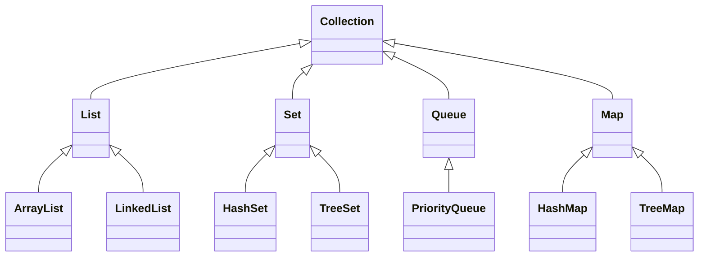
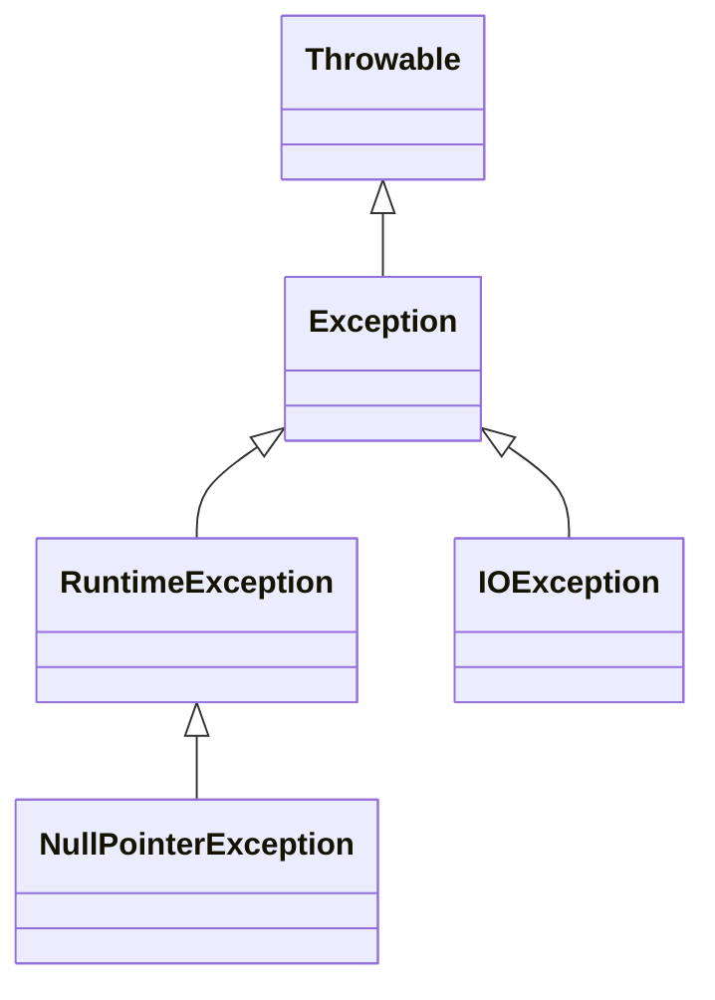

# Chapter 2 Java Fundamentals: 2.3 Advanced Java Concepts

## Introduction

Welcome to **Chapter 2.3: Advanced Java Concepts**. This section delves deep into the more intricate facets of Java that are pivotal for building robust, scalable, and efficient enterprise-level applications. As senior backend developers transitioning from environments like Node.js and TypeScript, understanding these advanced Java concepts will empower you to harness the full potential of Java and Spring Boot in crafting sophisticated microservices and large-scale systems.

**Key Topics Covered:**

1. **Collections Framework**
2. **Generics**
3. **Exception Handling**
4. **Java 8+ Features (Lambda Expressions, Streams API)**

Each topic is explored with detailed explanations, comprehensive code examples, practical applications, and advanced insights to ensure a thorough understanding and seamless application in real-world scenarios.

## 1. Collections Framework

The **Java Collections Framework** is a unified architecture that provides a set of interfaces, implementations, and algorithms to handle groups of objects efficiently. Mastery of this framework is essential for managing data within applications, optimizing performance, and ensuring maintainable codebases.

### 1.1. Overview of Collections Framework

The Collections Framework encompasses several interfaces and classes that facilitate the storage, retrieval, manipulation, and communication of data. The primary interfaces include:

- **List**: An ordered collection allowing duplicate elements.
- **Set**: A collection that prohibits duplicate elements.
- **Queue**: A collection designed for holding elements prior to processing.
- **Map**: An object that maps keys to values, with unique keys.

**Mermaid Diagram: Collections Framework Hierarchy**



*Figure 2.3.1: Collections Framework Hierarchy*

### 1.2. Choosing the Right Collection

Understanding the characteristics of each collection type is crucial for selecting the most appropriate one based on specific use cases.

| **Interface** | **Implementation** | **Use Case** | **Performance Considerations** |
|---------------|---------------------|--------------|-------------------------------|
| **List** | `ArrayList`, `LinkedList` | Ordered data, frequent access | `ArrayList`: Fast random access<br>`LinkedList`: Efficient insertions/removals |
| **Set** | `HashSet`, `TreeSet` | Unique elements, no duplicates | `HashSet`: Constant-time performance<br>`TreeSet`: Sorted order, log(n) time |
| **Queue** | `PriorityQueue`, `LinkedList` | FIFO operations, priority-based processing | `PriorityQueue`: Natural ordering<br>`LinkedList`: FIFO operations |
| **Map** | `HashMap`, `TreeMap` | Key-value pairs, unique keys | `HashMap`: Constant-time performance<br>`TreeMap`: Sorted keys, log(n) time |

### 1.3. Advanced Collections Usage

#### 1.3.1. NavigableSet and NavigableMap

These interfaces extend `SortedSet` and `SortedMap` respectively, providing navigation methods for handling sorted collections.

**Example: Using NavigableSet**

```java:path/to/java_fundamentals/AdvancedCollectionsExample.java
// AdvancedCollectionsExample.java
import java.util.NavigableSet;
import java.util.TreeSet;

public class AdvancedCollectionsExample {
    public static void main(String[] args) {
        NavigableSet<Integer> navigableSet = new TreeSet<>();
        navigableSet.add(10);
        navigableSet.add(20);
        navigableSet.add(30);
        navigableSet.add(40);
        navigableSet.add(50);

        System.out.println("Original NavigableSet: " + navigableSet);

        // Retrieving subsets
        NavigableSet<Integer> headSet = navigableSet.headSet(30, true);
        System.out.println("HeadSet (<=30): " + headSet);

        NavigableSet<Integer> tailSet = navigableSet.tailSet(30, true);
        System.out.println("TailSet (>=30): " + tailSet);

        // Getting lower and higher elements
        System.out.println("Lower than 30: " + navigableSet.lower(30));
        System.out.println("Higher than 30: " + navigableSet.higher(30));

        // Ceiling and floor
        System.out.println("Ceiling of 25: " + navigableSet.ceiling(25));
        System.out.println("Floor of 35: " + navigableSet.floor(35));
    }
}
```

**Output:**
```
Original NavigableSet: [10, 20, 30, 40, 50]
HeadSet (<=30): [10, 20, 30]
TailSet (>=30): [30, 40, 50]
Lower than 30: 20
Higher than 30: 40
Ceiling of 25: 30
Floor of 35: 30
```

**Explanation:**

- `headSet(30, true)`: Retrieves all elements less than or equal to 30.
- `tailSet(30, true)`: Retrieves all elements greater than or equal to 30.
- `lower(30)`: Gets the greatest element less than 30.
- `higher(30)`: Gets the least element greater than 30.
- `ceiling(25)`: Retrieves the smallest element greater than or equal to 25.
- `floor(35)`: Retrieves the greatest element less than or equal to 35.

**Practical Application:**

Navigable collections are invaluable when dealing with range queries, such as fetching records within a specific date range or processing elements based on priority levels.

#### 1.3.2. Concurrent Collections

In multi-threaded environments, **Concurrent Collections** ensure thread-safe operations without the need for explicit synchronization.

**Example: Using ConcurrentHashMap**

```java:path/to/java_fundamentals/ConcurrentCollectionsExample.java
// ConcurrentCollectionsExample.java
import java.util.concurrent.ConcurrentHashMap;
import java.util.concurrent.ExecutorService;
import java.util.concurrent.Executors;

public class ConcurrentCollectionsExample {
    public static void main(String[] args) {
        ConcurrentHashMap<String, Integer> concurrentMap = new ConcurrentHashMap<>();

        ExecutorService executor = Executors.newFixedThreadPool(3);

        // Simulating concurrent updates
        for(int i = 0; i < 5; i++) {
            final int value = i;
            executor.submit(() -> {
                concurrentMap.put("Key" + value, value);
                System.out.println("Inserted Key" + value + ": " + value);
            });
        }

        executor.shutdown();

        // Final state of the map
        System.out.println("Final ConcurrentHashMap: " + concurrentMap);
    }
}
```

**Output:**
```
Inserted Key0: 0
Inserted Key1: 1
Inserted Key2: 2
Inserted Key3: 3
Inserted Key4: 4
Final ConcurrentHashMap: {Key0=0, Key1=1, Key2=2, Key3=3, Key4=4}
```

**Explanation:**

`ConcurrentHashMap` allows safe concurrent access and modifications by multiple threads without compromising data integrity.

**Practical Application:**

Essential in high-concurrency applications like web servers handling multiple client requests simultaneously, ensuring consistent data states.

### 1.4. Best Practices with Collections

- **Prefer Interfaces Over Implementations:** Declare variables using collection interfaces (`List`, `Set`, `Map`) rather than concrete classes to enhance flexibility.
  
  ```java
  List<String> names = new ArrayList<>();
  ```
  
- **Consider Initial Capacity:** For `ArrayList` and `HashMap`, setting an appropriate initial capacity can minimize performance overhead due to resizing.
  
  ```java
  List<String> names = new ArrayList<>(100); // Initial capacity of 100
  Map<String, Integer> scores = new HashMap<>(50);
  ```
  
- **Immutable Collections:** Utilize `Collections.unmodifiableList()` or Java 9's `List.of()` to create immutable collections, enhancing thread safety and predictability.
  
  ```java
  List<String> immutableNames = Collections.unmodifiableList(names);
  // or using Java 9+
  List<String> immutableNames = List.of("Alice", "Bob", "Charlie");
  ```

- **Stream APIs:** Leverage Java Streams for more readable and expressive data processing over collections.
  
  ```java
  List<String> filteredNames = names.stream()
                                    .filter(name -> name.startsWith("A"))
                                    .collect(Collectors.toList());
  ```

### 1.5. Common Pitfalls and How to Avoid Them

- **Concurrent Modification Exception:** Modifying a collection while iterating leads to `ConcurrentModificationException`.
  
  **Solution:** Use `Iterator`'s `remove()` method or concurrent collections like `ConcurrentHashMap`.
  
  ```java
  Iterator<String> iterator = names.iterator();
  while(iterator.hasNext()) {
      String name = iterator.next();
      if(name.equals("Alice")) {
          iterator.remove(); // Safe removal
      }
  }
  ```

- **Choosing Wrong Collection Type:** Selecting an inappropriate collection can degrade performance.
  
  **Solution:** Analyze the use case requirements (ordering, uniqueness, access patterns) before choosing a collection type.

- **Ignoring Thread Safety:** Using non-concurrent collections in multi-threaded contexts can lead to unpredictable behavior.
  
  **Solution:** Opt for concurrent collections or synchronize access explicitly.

## 2. Generics

Generics enhance Java's type safety by allowing classes, interfaces, and methods to operate on objects of various types while providing compile-time type checking.

### 2.1. Understanding Generics

Generics enable the creation of classes and methods that can operate on any specified type, reducing code duplication and enhancing type safety.

**Example: Generic Box Class**

```java:path/to/java_fundamentals/GenericBox.java
// GenericBox.java
public class GenericBox<T> {
    private T content;

    public GenericBox(T content) {
        this.content = content;
    }

    public T getContent() {
        return content;
    }

    public void setContent(T content) {
        this.content = content;
    }
}
```

**Usage:**

```java:path/to/java_fundamentals/GenericBoxTest.java
// GenericBoxTest.java
public class GenericBoxTest {
    public static void main(String[] args) {
        GenericBox<String> stringBox = new GenericBox<>("Hello Generics");
        System.out.println(stringBox.getContent()); // Output: Hello Generics

        GenericBox<Integer> integerBox = new GenericBox<>(123);
        System.out.println(integerBox.getContent()); // Output: 123
    }
}
```

**Explanation:**

- `<T>` is a type parameter that can be replaced with any reference type.
- Ensures that only objects of the specified type are stored, preventing `ClassCastException` at runtime.

### 2.2. Bounded Type Parameters

Bounded type parameters restrict the types that can be used as type arguments, providing more control and flexibility.

**Example: Bounded Generic Method**

```java:path/to/java_fundamentals/BoundedGenericsExample.java
// BoundedGenericsExample.java
public class BoundedGenericsExample {
    // Method accepts Number or its subclasses
    public static <T extends Number> double add(T a, T b) {
        return a.doubleValue() + b.doubleValue();
    }

    public static void main(String[] args) {
        double sum = add(10, 20); // Integer
        System.out.println("Sum: " + sum); // Output: Sum: 30.0

        sum = add(15.5, 24.5); // Double
        System.out.println("Sum: " + sum); // Output: Sum: 40.0

        // sum = add("10", "20"); // Compilation Error
    }
}
```

**Explanation:**

- `<T extends Number>` ensures that only numeric types (`Number` and its subclasses) can be used.
- Prevents misuse by disallowing non-numeric type arguments.

### 2.3. Generics with Collections

Combining generics with collections provides stringent type checks and eliminates the need for explicit casting.

**Example: Generic Repository Interface**

```java:path/to/java_fundamentals/GenericRepository.java
// GenericRepository.java
import java.util.List;

public interface GenericRepository<T> {
    void save(T entity);
    T findById(int id);
    List<T> findAll();
    void delete(T entity);
}
```

**Implementation for User Entity**

```java:path/to/java_fundamentals/UserRepository.java
// UserRepository.java
import java.util.ArrayList;
import java.util.List;

public class UserRepository implements GenericRepository<User> {
    private List<User> users = new ArrayList<>();

    @Override
    public void save(User user) {
        users.add(user);
        System.out.println("User saved: " + user.getName());
    }

    @Override
    public User findById(int id) {
        return users.stream()
                    .filter(u -> u.getId() == id)
                    .findFirst()
                    .orElse(null);
    }

    @Override
    public List<User> findAll() {
        return users;
    }

    @Override
    public void delete(User user) {
        users.remove(user);
        System.out.println("User deleted: " + user.getName());
    }
}
```

**Usage:**

```java:path/to/java_fundamentals/RepositoryTest.java
// RepositoryTest.java
public class RepositoryTest {
    public static void main(String[] args) {
        GenericRepository<User> userRepo = new UserRepository();
        User user1 = new User(1, "Alice");
        User user2 = new User(2, "Bob");

        userRepo.save(user1);
        userRepo.save(user2);

        User fetchedUser = userRepo.findById(1);
        System.out.println("Fetched User: " + fetchedUser.getName());

        userRepo.delete(user1);
        System.out.println("All Users: " + userRepo.findAll());
    }
}
```

**Output:**
```
User saved: Alice
User saved: Bob
Fetched User: Alice
User deleted: Alice
All Users: [Bob]
```

**Explanation:**

- `GenericRepository<T>` defines CRUD operations for any entity type.
- `UserRepository` implements the interface for the `User` entity, ensuring type safety and reusability.

### 2.4. Wildcards and Type Bounds

Wildcards (`?`) allow for more flexible method signatures and can handle unknown types in generics.

**Example: Using Wildcards with Collections**

```java:path/to/java_fundamentals/WildcardsExample.java
// WildcardsExample.java
import java.util.Arrays;
import java.util.List;

public class WildcardsExample {
    // Accepts any list of Number or its subclasses
    public static void printNumbers(List<? extends Number> numbers) {
        for(Number num : numbers) {
            System.out.println(num);
        }
    }

    // Adds integers to a list that accepts Number or its superclasses
    public static void addNumbers(List<? super Integer> numbers) {
        numbers.add(10);
        numbers.add(20);
    }

    public static void main(String[] args) {
        List<Integer> integerList = Arrays.asList(1, 2, 3);
        printNumbers(integerList); // Works: List<Integer> is a subtype of List<? extends Number>

        List<Object> objectList = Arrays.asList();
        addNumbers(objectList); // Works: List<Object> is a supertype of List<? super Integer>

        // List<Double> doubleList = Arrays.asList(1.0, 2.0);
        // addNumbers(doubleList); // Compilation Error
    }
}
```

**Explanation:**

- `? extends Number`: Allows reading from the collection as `Number`, but prevents adding new elements.
- `? super Integer`: Allows adding `Integer` objects to the collection, but restricts reading to `Object`.

**Practical Application:**

Facilitates the creation of versatile APIs that can operate on a range of types while maintaining type safety.

### 2.5. Best Practices with Generics

- **Use Generics to Enhance Type Safety:** Avoid raw types to prevent `ClassCastException` at runtime.
  
  ```java
  // Avoid raw types
  List list = new ArrayList();
  list.add("String");
  String str = (String) list.get(0); // Risky casting

  // Use generics
  List<String> stringList = new ArrayList<>();
  stringList.add("String");
  String str = stringList.get(0); // Safe
  ```

- **Prefer Type Inference with the Diamond Operator:** Simplify code by omitting redundant type parameters.

  ```java
  // Before Java 7
  List<String> names = new ArrayList<String>();

  // After Java 7
  List<String> names = new ArrayList<>();
  ```

- **Leverage Bounded Type Parameters for Flexibility:** Restrict generic types when necessary to ensure correct usage.

  ```java
  public <T extends Comparable<T>> T findMax(List<T> list) {
      // Implementation
  }
  ```

- **Limit the Use of Wildcards:** Use wildcards judiciously to maintain API clarity and prevent overcomplication.

## 3. Exception Handling

Effective exception handling ensures that applications can gracefully handle unexpected scenarios, maintain robustness, and provide meaningful feedback to users and developers.

### 3.1. Exception Hierarchy in Java

Java's exception hierarchy is split into **checked** and **unchecked** exceptions:

- **Checked Exceptions (`Exception` subclasses excluding `RuntimeException`):**
  - Enforced by the compiler.
  - Must be declared or handled.
  - Examples: `IOException`, `SQLException`.

- **Unchecked Exceptions (`RuntimeException` subclasses):**
  - Not enforced by the compiler.
  - Typically indicate programming errors.
  - Examples: `NullPointerException`, `ArrayIndexOutOfBoundsException`.

**Mermaid Diagram: Exception Hierarchy**



*Figure 2.3.2: Exception Hierarchy in Java*

### 3.2. Creating Custom Exceptions

Custom exceptions allow developers to create meaningful error handling tailored to specific application requirements.

**Example: Custom Checked Exception**

```java:path/to/java_fundamentals/InsufficientFundsException.java
// InsufficientFundsException.java
public class InsufficientFundsException extends Exception {
    public InsufficientFundsException(String message) {
        super(message);
    }
}
```

**Usage in a Banking Application**

```java:path/to/java_fundamentals/BankAccount.java
// BankAccount.java
public class BankAccount {
    private double balance;

    public BankAccount(double initialBalance) {
        this.balance = initialBalance;
    }

    public void withdraw(double amount) throws InsufficientFundsException {
        if(amount > balance) {
            throw new InsufficientFundsException("Attempted to withdraw " + amount + " with balance " + balance);
        }
        balance -= amount;
    }

    public double getBalance() {
        return balance;
    }
}
```

```java:path/to/java_fundamentals/BankAccountTest.java
// BankAccountTest.java
public class BankAccountTest {
    public static void main(String[] args) {
        BankAccount account = new BankAccount(100.0);
        try {
            account.withdraw(150.0);
        } catch (InsufficientFundsException e) {
            System.err.println("Error: " + e.getMessage());
        }
    }
}
```

**Output:**
```
Error: Attempted to withdraw 150.0 with balance 100.0
```

**Explanation:**

- **`InsufficientFundsException`**: A custom checked exception signaling an invalid withdrawal attempt.
- **`BankAccount.withdraw`**: Throws the custom exception when withdrawal exceeds the balance.
- **`BankAccountTest`**: Demonstrates handling the custom exception gracefully.

### 3.3. Best Practices in Exception Handling

- **Use Specific Exceptions:** Catch and handle specific exceptions instead of generic ones to provide precise error handling.
  
  ```java
  try {
      // Code that may throw exceptions
  } catch (IOException e) {
      // Handle IO exceptions
  } catch (SQLException e) {
      // Handle SQL exceptions
  }
  ```

- **Avoid Empty Catch Blocks:** Silently catching exceptions can obscure issues and make debugging difficult.
  
  ```java
  // Bad Practice
  try {
      // Code
  } catch (Exception e) {
      // Do nothing
  }
  ```

- **Use Finally or Try-With-Resources:** Ensure that resources are closed properly to prevent resource leaks.
  
  ```java:path/to/java_fundamentals/TryWithResourcesExample.java
  // TryWithResourcesExample.java
  import java.io.BufferedReader;
  import java.io.FileReader;
  import java.io.IOException;

  public class TryWithResourcesExample {
      public static void main(String[] args) {
          try (BufferedReader reader = new BufferedReader(new FileReader("file.txt"))) {
              String line;
              while((line = reader.readLine()) != null) {
                  System.out.println(line);
              }
          } catch (IOException e) {
              e.printStackTrace();
          }
      }
  }
  ```

- **Don't Use Exceptions for Control Flow:** Exceptions should represent exceptional conditions, not regular program logic.

### 3.4. Advanced Exception Handling Techniques

#### 3.4.1. Exception Chaining

Exception chaining allows capturing the original cause of an exception, facilitating better diagnostics and troubleshooting.

**Example: Chained Exceptions**

```java:path/to/java_fundamentals/ChainedExceptionsExample.java
// ChainedExceptionsExample.java
public class ChainedExceptionsExample {
    public static void main(String[] args) {
        try {
            methodA();
        } catch (CustomException e) {
            e.printStackTrace();
        }
    }

    public static void methodA() throws CustomException {
        try {
            methodB();
        } catch (NullPointerException e) {
            throw new CustomException("Error in methodA", e);
        }
    }

    public static void methodB() {
        throw new NullPointerException("Simulated NullPointerException");
    }
}
```

**CustomException Class**

```java:path/to/java_fundamentals/CustomException.java
// CustomException.java
public class CustomException extends Exception {
    public CustomException(String message, Throwable cause) {
        super(message, cause);
    }
}
```

**Output:**
```
CustomException: Error in methodA
    at ChainedExceptionsExample.methodA(ChainedExceptionsExample.java:13)
    at ChainedExceptionsExample.main(ChainedExceptionsExample.java:7)
Caused by: java.lang.NullPointerException: Simulated NullPointerException
    at ChainedExceptionsExample.methodB(ChainedExceptionsExample.java:19)
    at ChainedExceptionsExample.methodA(ChainedExceptionsExample.java:11)
    ... 1 more
```

**Explanation:**

- **Exception Chaining:** `CustomException` wraps the original `NullPointerException`, preserving the exception hierarchy and providing context.
- Facilitates debugging by retaining the original stack trace.

#### 3.4.2. Creating Custom Checked and Unchecked Exceptions

Differentiating between checked and unchecked exceptions based on whether the application can recover from the exception.

**Unchecked Exception Example**

```java:path/to/java_fundamentals/InsufficientBalanceException.java
// InsufficientBalanceException.java
public class InsufficientBalanceException extends RuntimeException {
    public InsufficientBalanceException(String message) {
        super(message);
    }
}
```

**Usage:**

```java:path/to/java_fundamentals/Bank.java
// Bank.java
public class Bank {
    private double balance;

    public void deposit(double amount) {
        balance += amount;
    }

    public void withdraw(double amount) {
        if(amount > balance) {
            throw new InsufficientBalanceException("Withdrawal amount exceeds balance.");
        }
        balance -= amount;
    }

    public double getBalance() {
        return balance;
    }
}
```

**Explanation:**

- **`InsufficientBalanceException`**: An unchecked exception indicating an invalid withdrawal.
- **Usage in `Bank` class**: Throws the exception without enforcing handling, as it represents a critical, unrecoverable error state.

### 3.5. Best Practices for Exception Handling

- **Document Exceptions:** Clearly document which exceptions a method can throw using Javadoc `@throws` tags.
  
  ```java
  /**
   * Withdraws the specified amount from the account.
   *
   * @param amount The amount to withdraw
   * @throws InsufficientFundsException If the withdrawal amount exceeds the balance
   */
  public void withdraw(double amount) throws InsufficientFundsException {
      // Method implementation
  }
  ```

- **Handle Exceptions at Appropriate Levels:** Catch exceptions where it makes sense to handle them, avoiding catching exceptions too high or too low in the call stack.
- **Provide Meaningful Messages:** Ensure that exception messages are clear and provide sufficient context for debugging.
  
  ```java
  throw new InvalidUserInputException("Username cannot be null or empty.");
  ```

- **Use Finally for Cleanup:** Utilize the `finally` block to release resources regardless of whether an exception was thrown.

  ```java
  BufferedReader reader = null;
  try {
      reader = new BufferedReader(new FileReader("file.txt"));
      // Read file
  } catch (IOException e) {
      e.printStackTrace();
  } finally {
      if(reader != null) {
          try {
              reader.close();
          } catch (IOException e) {
              e.printStackTrace();
          }
      }
  }
  ```

## 4. Java 8+ Features (Lambda Expressions, Streams API)

Java 8 introduced significant enhancements that revolutionized how developers write code, making it more concise, readable, and functional. **Lambda Expressions** and the **Streams API** are at the forefront of these advancements.

### 4.1. Lambda Expressions

Lambda expressions provide a clear and concise way to represent one method interface using an expression, enabling functional programming paradigms within Java.

**Syntax:**

```java
(parameters) -> expression
(parameters) -> { statements; }
```

**Example: Using Lambda with Runnable**

```java:path/to/java_fundamentals/LambdaExample.java
// LambdaExample.java
public class LambdaExample {
    public static void main(String[] args) {
        // Before Java 8: Using anonymous class
        Runnable runnable = new Runnable() {
            @Override
            public void run() {
                System.out.println("Runnable running");
            }
        };
        runnable.run();

        // After Java 8: Using lambda expression
        Runnable lambdaRunnable = () -> System.out.println("Lambda Runnable running");
        lambdaRunnable.run();
    }
}
```

**Output:**
```
Runnable running
Lambda Runnable running
```

**Explanation:**

- Lambda expressions reduce boilerplate code by eliminating the need for anonymous class implementations.

### 4.2. Functional Interfaces

A **Functional Interface** is an interface with a single abstract method, making it eligible for lambda expressions.

**Example: Custom Functional Interface**

```java:path/to/java_fundamentals/CalculatorFunctionalInterface.java
// CalculatorFunctionalInterface.java
@FunctionalInterface
public interface Calculator {
    int compute(int a, int b);
}
```

**Usage with Lambda Expression**

```java:path/to/java_fundamentals/CalculatorTest.java
// CalculatorTest.java
public class CalculatorTest {
    public static void main(String[] args) {
        Calculator addition = (a, b) -> a + b;
        Calculator multiplication = (a, b) -> a * b;

        System.out.println("Addition: " + addition.compute(5, 3)); // Output: 8
        System.out.println("Multiplication: " + multiplication.compute(5, 3)); // Output: 15
    }
}
```

**Explanation:**

- The `Calculator` interface is a functional interface, allowing the use of lambda expressions for its implementation.

### 4.3. Streams API

The **Streams API** enables processing sequences of elements with operations such as filtering, mapping, and reducing in a declarative manner.

**Example: Processing a List of Users**

```java:path/to/java_fundamentals/StreamsExample.java
// StreamsExample.java
import java.util.Arrays;
import java.util.List;
import java.util.stream.Collectors;

public class StreamsExample {
    public static void main(String[] args) {
        List<User> users = Arrays.asList(
            new User(1, "Alice", 30),
            new User(2, "Bob", 25),
            new User(3, "Charlie", 35),
            new User(4, "Diana", 28)
        );

        // Filtering users older than 28 and collecting their names
        List<String> names = users.stream()
                                  .filter(user -> user.getAge() > 28)
                                  .map(User::getName)
                                  .collect(Collectors.toList());

        System.out.println("Users older than 28: " + names);
    }
}
```

**Output:**
```
Users older than 28: [Alice, Charlie]
```

**Explanation:**

- **`filter`**: Selects users with age greater than 28.
- **`map`**: Transforms `User` objects to their names.
- **`collect`**: Gathers the results into a list.

### 4.4. Parallel Streams

Streams can be processed in parallel, leveraging multi-core processors to enhance performance for large data sets.

**Example: Parallel Processing**

```java:path/to/java_fundamentals/ParallelStreamsExample.java
// ParallelStreamsExample.java
import java.util.Arrays;
import java.util.List;

public class ParallelStreamsExample {
    public static void main(String[] args) {
        List<Integer> numbers = Arrays.asList(1, 2, 3, 4, 5, 6, 7, 8, 9, 10);

        int sum = numbers.parallelStream()
                         .filter(n -> n % 2 == 0)
                         .mapToInt(Integer::intValue)
                         .sum();

        System.out.println("Sum of even numbers: " + sum); // Output: 30
    }
}
```

**Explanation:**

- **`parallelStream()`**: Creates a parallel stream that processes elements concurrently.
- Enhances performance on multi-core systems for compute-intensive operations.

### 4.5. Best Practices with Lambda Expressions and Streams

- **Prefer Method References Over Lambdas When Possible:**
  
  ```java
  // Using Lambda
  consumers.forEach(c -> c.accept(item));

  // Using Method Reference
  consumers.forEach(c -> c.accept(item)); // Equivalent to consumers.forEach(c -> c.accept(item))
  ```

- **Avoid Side Effects in Stream Operations:** Stream operations should be stateless and free from side effects to maintain predictability and thread safety.
  
  ```java
  // Bad Practice
  List<String> result = new ArrayList<>();
  users.stream()
       .filter(user -> user.getAge() > 28)
       .forEach(user -> result.add(user.getName())); // Side effect

  // Good Practice
  List<String> result = users.stream()
                             .filter(user -> user.getAge() > 28)
                             .map(User::getName)
                             .collect(Collectors.toList());
  ```

- **Use Parallel Streams Judiciously:** Not all operations benefit from parallelism. Assess the overhead and thread-safety before opting for parallel streams.
  
  ```java
  // Use parallelStream() when:
  // - The data set is large
  // - Operations are CPU-intensive
  // - Operations are stateless and thread-safe
  ```

- **Chain Operations Effectively:** Leverage the fluent API of streams for readable and maintainable code.

  ```java
  List<String> names = users.stream()
                            .filter(User::isActive)
                            .sorted(Comparator.comparing(User::getName))
                            .map(User::getName)
                            .collect(Collectors.toList());
  ```

### 4.6. Common Pitfalls and How to Avoid Them

- **Mutating Shared Data in Parallel Streams:** Can lead to unpredictable results and race conditions.
  
  **Solution:** Ensure that operations on parallel streams are stateless and avoid modifying shared mutable state.

- **Overusing Streams for Simple Tasks:** For straightforward iterations, traditional loops can be more readable and performant.
  
  **Solution:** Use streams when they provide a clear advantage in terms of readability or performance.

- **Ignoring Short-Circuiting Operations:** Operations like `findFirst`, `anyMatch`, or `limit` can optimize stream processing by terminating early.
  
  **Solution:** Utilize short-circuiting operations where appropriate to enhance performance.

## Summary

In **Section 2.3: Advanced Java Concepts**, we've explored the pivotal elements that elevate Java's capabilities in enterprise-level development:

1. **Collections Framework**: Mastery of various collection types and their optimal use cases ensures efficient data management.
2. **Generics**: Enhances type safety and code reusability, enabling the creation of versatile and robust APIs.
3. **Exception Handling**: Effective management of exceptions fortifies application stability and facilitates graceful error recovery.
4. **Java 8+ Features**: Lambda expressions and the Streams API revolutionize how data processing and functional programming are approached in Java.

By internalizing these advanced concepts, you are well-equipped to architect and develop sophisticated, maintainable, and high-performance Java applications using Spring Boot.

## Next Steps and Practical Exercises

1. **Hands-On Project: Implement a Generic Repository**
   - Create a generic repository interface and implement it for multiple entities (e.g., `User`, `Product`).
   - Apply bounded type parameters to restrict repository operations to specific types.

2. **Exception Handling Workshop**
   - Develop a banking application module that handles various transaction-related exceptions.
   - Implement custom checked and unchecked exceptions, ensuring proper exception chaining and logging.

3. **Stream API Challenge**
   - Process large datasets (e.g., log files) using the Streams API.
   - Optimize performance by leveraging parallel streams and method references.

4. **Collections Deep Dive**
   - Analyze and compare the performance of different collections (`ArrayList` vs. `LinkedList`, `HashSet` vs. `TreeSet`) in various scenarios.
   - Refactor existing code to utilize the most appropriate collection types based on use cases.

5. **Generics Puzzle**
   - Design a type-safe event handling system using generics and wildcards.
   - Ensure that the system can handle events of various types without compromising type safety.

## Additional Resources

- **Official Documentation:**
  - [Java Collections Framework](https://docs.oracle.com/javase/8/docs/technotes/guides/collections/overview.html)
  - [Java Generics](https://docs.oracle.com/javase/tutorial/java/generics/)
  - [Java Exception Handling](https://docs.oracle.com/javase/tutorial/essential/exceptions/)
  - [Java 8 Lambda Expressions and Streams](https://docs.oracle.com/javase/tutorial/java/javaOO/lambdaexpressions.html)

- **Books:**
  - *Effective Java* by Joshua Bloch
  - *Java Concurrency in Practice* by Brian Goetz

- **Online Tutorials and Articles:**
  - [Baeldung’s Guide to Java Collections](https://www.baeldung.com/java-collections)
  - [Understanding Generics in Java](https://www.baeldung.com/java-generics)
  - [Java Streams API Tutorial](https://www.baeldung.com/java-8-streams)

- **Communities:**
  - [Stack Overflow Java Tag](https://stackoverflow.com/questions/tagged/java)
  - [Reddit’s r/java](https://www.reddit.com/r/java/)
  - [Java Discord Communities](https://discord.com/invite/java)

Embrace these advanced Java concepts to enhance your development prowess and build state-of-the-art Spring Boot applications that stand the test of time.
